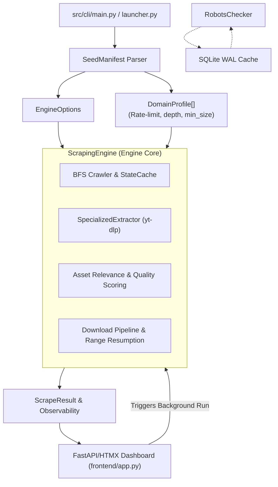

# scrAPE — Scraper for Archival & Production Extraction

<p align="center">
  
</p>

<p align="center">
  <strong>FastAPI + HTMX Brutalist Media Scraper & Autonomous Archival Engine</strong>
</p>

<p align="center">
  <a href="#quick-start">Quick Start</a> •
  <a href="#key-features">Key Features</a> •
  <a href="#waf-turnstile--js-only-bypass">WAF Bypass</a> •
  <a href="#seed-manifest-format">Seed Manifests</a> •
  <a href="#architecture-overview">Architecture</a> •
  <a href="#documentation">Documentation</a>
</p>

---

## Overview

**scrAPE** is a high-throughput, autonomous batch media scraper designed for domain crawling, image and video asset discovery, quality-based relevance filtering, and resilient asset extraction. Powered by a decoupled **FastAPI + HTMX** tactical WebUI, a 7-tier WAF fallback pipeline, and persistent SQLite WAL state caching, scrAPE handles complex single-page applications (SPAs), Cloudflare Turnstile protections, and high-concurrency downloads with real-time hardware telemetry.

---

## Quick Start

### 1. Global CLI Installation (Recommended)

Run the interactive dashboard from any terminal window:

- **Windows**: Run `.\install.bat` from the root directory.
- **macOS / Linux**: Run `pip install -e .` from the root directory.

Once installed, launch from any terminal:

```bash
scrape
```

> *Note: On initial launch, missing dependencies (`crawlee_bridge` Node.js modules and Playwright Chromium binaries) are detected and installed automatically.*

### 2. Manual Launch (Without Global Install)

```bash
# Install Python dependencies
pip install -r requirements.txt

# Start the interactive WebUI Command Center (http://localhost:10001)
.\run_frontend.bat

# Or run via CLI with keyword and seed file
python src/cli/main.py --keyword example_subject --seed seeds/example_subject.txt

# Run with explicit execution limits (bypasses wizard)
python src/cli/main.py --keyword example_subject --seed seeds/example_subject.txt --max-results 50 --page-limit 100 --workers 8 --dl-workers 8 --download-media
```

---

## Key Features

- **Dynamic HTMX Tactical WebUI** — Fully decoupled dashboard (`frontend/`) featuring context-aware telemetry stat cards (switching between global totals and per-subject counts with `/ N total` comparisons), real-time OS hardware telemetry (CPU, RAM, Disk), process abort controls, and physical file management (open local folder, delete files) directly inside the Media Vault.
- **Option C Context-Aware Statistics** — Telemetry stat cards dynamically adapt to your view context: global cumulative totals on the Command Center, or per-subject counts when exploring a target in the Media Vault.
- **Vector Branding & System Tray Runner** — Embedded SVG vector artwork across web and terminal interfaces, zero-dependency inline SVG favicon loading, and a custom hand-crafted high-contrast PIL system tray runner (`src/cli/launcher.py`, RGBA 64×64) tuned for 16px/24px taskbar legibility.
- **WAF & Turnstile 8-Tier Fallback** — Defeats Cloudflare Turnstile, Auth walls, and anti-bot protections using an 8-tier escalation chain: `Local Cookies` → `Crawl4AI` → `Crawlee Cheerio` → `DrissionPage` → `Crawlee Puppeteer` → `Helium` → `undetected-chromedriver` → `Camoufox` → `FlareSolverr`.
- **Seed Manifest Engine Overrides & Memory Caching** — Force specific WAF engines per domain via `# engine: <name>` annotations; successful solvers are cached per host (`HttpClient._preferred_engine_by_host`) and prioritized automatically.
- **Resumable Crawl & Download Checkpointing** — Persistent SQLite queue and download state (`output/.crawl_state.sqlite`), paired with HTTP `Range` request byte resumption (HTTP 206 Partial Content) to resume interrupted large media downloads.
- **AI Dataset Curation & Perceptual Deduplication** — Calculates 64-bit difference hashes (`dHash`) to reject visually identical or resized images (Hamming distance $\le 4$), generating `dataset.jsonl` manifests + individual `<image>.txt` caption sidecar files for direct LoRA/SD training pipelines.
- **Multi-Platform Extractor Plugins** — Zero-DOM direct extraction plugins for YouTube, TikTok, Reddit, Civitai, Danbooru/Gelbooru, Pinterest, and ArtStation.

---

## WAF, Turnstile & JS-Only Bypass

scrAPE features an 8-tier escalation pipeline to defeat Cloudflare WAF, Turnstile challenges, and JS-only rendering without expensive cloud proxy subscriptions:

| Tier | Engine / Method | Best Used For |
|---|---|---|
| **Tier 0** | **Local Cookie Harvesting** (`browser-cookie3`) | Reusing active browser session cookies from Chrome, Firefox, Edge, Brave |
| **Tier 1** | **Crawl4AI** | Standard headless browser page evaluation |
| **Tier 2** | **Crawlee (Cheerio)** | Fast static extraction with Node.js `got-scraping` TLS fingerprint spoofing |
| **Tier 3** | **DrissionPage** | Light JS challenges and basic Captcha bypass |
| **Tier 4** | **Crawlee (Puppeteer)** | Heavy JS-rendering with `puppeteer-extra-plugin-stealth` |
| **Tier 5** | **Helium** | High-level browser control fallback |
| **Tier 6** | **Undetected-Chromedriver (UC)** | Stealth layer for persistent Cloudflare challenges |
| **Tier 7** | **Camoufox** | C++ stealth Firefox engine with OS fingerprint matching & 20s Turnstile escalation |
| **Tier 8** | **FlareSolverr** | Dedicated solver service integration with domain session reuse & proxy forwarding |

---

## Seed Manifest Format

Each `.txt` seed file defines extraction rules per domain using comment annotations (`# <key>: <value>`):

| Annotation | Example | Description |
|---|---|---|
| `# type: <video\|image\|mixed>` | `# type: image` | Media type hint & extraction strategy |
| `# crawl: <direct\|index→detail>` | `# crawl: direct` | Use `direct` to skip link discovery and scrape target URLs only |
| `# depth: <int>` | `# depth: 1` | BFS crawl depth override (default 1 for index, 0 for direct) |
| `# Rate-limit: <float> req/s` | `# Rate-limit: 0.5 req/s` | Requests-per-second throttle for domain |
| `# max_pages: <int>` | `# max_pages: 10` | Hard cap on pages crawled per domain per run |
| `# cloudflare: true` | `# cloudflare: true` | Skips light tiers on 403/429, escalating directly to stealth browsers |
| `# skip-link-discovery` | `# skip-link-discovery` | Skip crawling/link discovery entirely |
| `# [CDN] <hostname>` | `# [CDN] cdn.domain.com` | Whitelist CDN domain (bypasses page-level penalties) |
| `# min_image_size: WxH` | `# min_image_size: 1000x800` | Minimum accepted image dimensions |
| `# thumbnail_prefix: <pattern>` | `# thumbnail_prefix: /thumbs/` | String pattern to reject thumbnail URLs early |
| `# requires_referer` | `# requires_referer` | Send page Referer header to bypass hotlinking protection |

### Example Manifest (`seeds/example_subject.txt`)

```text
# Subject: Example Subject
# Alt-Subject: Example / Subject Alt

# ---------------------------------------------------------------------------
# gallery.example.com
# ---------------------------------------------------------------------------
# type: image | crawl: direct
# min_image_size: 1000x800
# thumbnail_prefix: /thumbs/
https://gallery.example.com/subject
https://gallery.example.com/search?q=subject

# ---------------------------------------------------------------------------
# videos.example.org
# ---------------------------------------------------------------------------
# type: video | crawl: index→detail
# depth: 1
# Rate-limit: 0.4 req/s
# [CDN] cdn.example.org
# requires_referer
https://videos.example.org/subject
```

---

## Parameter Recommendations & Safety Guardrails

To preserve system responsiveness and avoid CDN IP rate limits (HTTP 429/503):

| Parameter | Recommended (Safe) | High-Performance | Over-Limit Warning | Risk / System Impact |
|---|---|---|---|---|
| **Scraper Workers** (`--workers`) | **4 – 8** | **12 – 16** | **> 16 workers** | High CPU/RAM utilization, browser process stalls |
| **Download Workers** (`--dl-workers`) | **4 – 8** | **12 – 16** | **> 24 workers** | Bandwidth saturation, CDN IP bans (429/503) |
| **Crawl Depth** (`--crawl-depth`) | **1 – 2** | **3 levels** | **> 4 levels** | Exponential link graph explosion |
| **Max Results** (`--max-results`) | **50 – 200** | **500 – 1000** | **0 (Unlimited)** | High disk usage (GBs of video storage) |
| **Page Limit** (`--page-limit`) | **20 – 50** | **100 – 200** | **0 (Unlimited)** | Unbounded network traffic, extended job duration |

---

## Architecture Overview



### Module Layout

| Directory / File | Description |
|---|---|
| `frontend/app.py` | FastAPI backend for HTMX WebUI, context-aware stats (`/htmx/subject-stats`), disk asset counter, live OS telemetry & process orchestrator |
| `frontend/templates/` | Brutalist HTMX dashboard templates (`index.html`, `gallery.html`) with inline SVG vector logo and data URI favicon |
| `crawlee_bridge/` | Express.js bridge running Crawlee Cheerio and Puppeteer stealth tiers |
| `src/cli/launcher.py` | Interactive CLI launcher & system tray manager (custom PIL RGBA 64×64 icon renderer) |
| `src/cli/cli_wizard.py` | Interactive wizard for standard crawls, watchdog runs, and dataset formatting |
| `src/core/engine.py` | Core `ScrapingEngine` orchestration entry point |
| `src/core/managers.py` | Decoupled `CrawlOrchestrator`, `MediaProcessor`, and `DomainRulesManager` |
| `src/core/filters.py` | Relevance scoring, low-res detection, and rejection reason algorithms |
| `src/storage/file_downloader.py` | Multi-threaded media fetcher with Range resumption and Pillow image sanitization |
| `src/storage/state_cache.py` | Persistent URL history using SQLite in WAL journal mode |

---

## Post-Run Observability

Every crawl generates an automated observability report at `output/{keyword_slug}/runs/{run_id}/run_summary.json`:

- **Phase Timing Breakdown** — BFS crawl duration vs media download duration.
- **Yield Statistics** — Pages scanned, kept assets, rejected items, download success/fail/skip counts.
- **Domain Metrics** — Granular per-domain counters for pages scanned, media kept, rejected items, and duplicate hash skips.
- **Rejection Diagnostics** — Frequency table of rejection reasons (e.g. `low_resolution`, `archive_penalty`, `duplicate_hash`).
- **Zero-Yield Domain Tracking** — Identifies domains with $>0$ scanned pages but 0 kept assets.
- **Failed Link Audit** — Exact list of failed download URLs with HTTP status codes and error tracebacks.

---

## Output Directory Structure

```text
output/
├── cache/
│   └── state_cache.db           # Persistent SQLite WAL cache of processed URLs
└── {keyword_slug}/
    └── runs/
        └── {run_id}/
            ├── results.json     # Complete scrape result manifest
            ├── run_summary.json # Observability metrics & execution summary
            ├── domain_report.json
            ├── images/          # Downloaded image assets
            └── videos/          # Downloaded video assets
```

---

## Documentation

Detailed documentation is available in the [`docs/`](docs/) directory:

- [Usage Guide](docs/USAGE.md) — CLI options, WebUI controls, and AI dataset tools
- [Architecture Guide](docs/ARCHITECTURE.md) — Internal data flow, dynamic plugins, and thread models
- [Configuration Reference](docs/CONFIGURATION.md) — Seed annotations, `config.py` settings, and normalisation rules
- [Quality Filters Reference](docs/QUALITY_FILTERS.md) — Scoring formulas, low-res patterns, and rejection rules
- [Changelog](docs/CHANGELOG.md) — Complete version release history

---

## License

Distributed under the **MIT License**. See [LICENSE](LICENSE) for more information.
