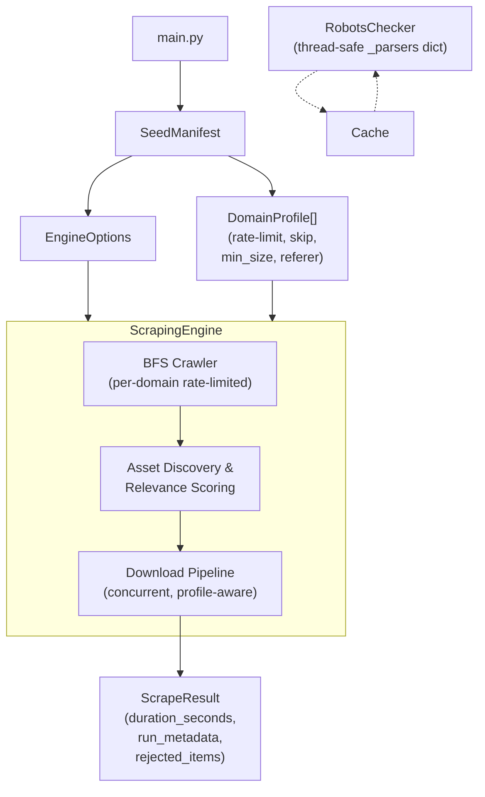

# scrAPE — Scraper for Archival & Production Extraction

      ██████  ▄████▄   ██▀███   ▄▄▄       ██▓███  ▓█████ 
    ▒██    ▒ ▒██▀ ▀█  ▓██ ▒ ██▒▒████▄    ▓██░  ██▒▓█   ▀ 
    ░ ▓██▄   ▒▓█    ▄ ▓██ ░▄█ ▒▒██  ▀█▄  ▓██░ ██▓▒▒███   
      ▒   ██▒▒▓▓▄ ▄██▒▒██▀▀█▄  ░██▄▄▄▄██ ▒██▄█▓▒ ▒▒▓█  ▄ 
    ▒██████▒▒▒ ▓███▀ ░░██▓ ▒██▒ ▓█   ▓██▒▒██▒ ░  ░░▒████▒
    ▒ ▒▓▒ ▒ ░░ ░▒ ▒  ░░ ▒▓ ░▒▓░ ▒▒   ▓▒█░▒▓▒░ ░  ░░░ ▒░ ░
    ░ ░▒  ░ ░  ░  ▒     ░▒ ░ ▒░  ▒   ▒▒ ░░▒ ░      ░ ░  ░
    ░  ░  ░  ░          ░░   ░   ░   ▒   ░░          ░   
          ░  ░ ░         ░           ░  ░            ░  ░
             ░                                           

**Batch media scraper** for crawling domains, discovering image/video assets, filtering for relevance, and downloading results.

---

## Features

- **Seed Manifest Parser** — Declarative domain profiles with `Rate-limit`, `skip-link-discovery`, `type`, `crawl`, `depth`, `min_image_size`, `thumbnail_prefix_pattern`, `requires_referer`, `cloudflare`, `max_pages`
- **BFS Crawler** — Breadth-first page discovery with configurable depth, page limits, and per-domain page caps
- **Concurrent Download Pipeline** — Multi-worker download pool with per-domain rate limiting and profile-aware settings (referer, min size, thumbnail rejection)
- **Quality Filters** — Relevance scoring (keyword + entity tokens), low-res detection (query params & URL path patterns), archive/index page penalty, preview marker detection, CDN whitelist
- **WAF Fallback Tiers** — Primary httpx → Tier-1 Crawl4AI headless → Tier-2 Crawl4AI headful. Domains flagged `cloudflare: true` skip fallback immediately.
- **JSON-Driven URL Normalisation** — Domain-specific URL canonicalisation rules live in `data/url_normalisation_rules.json`. No domain patterns are hardcoded in source.
- **Memory-Backed Dedup** — Inline duplicate rejection (same URL+reason suppressed) via thread-safe `add_rejected()` closure
- **Audit Trail** — `rejected_items` list with reason + score; `run_metadata` + `duration_seconds` on each `ScrapeResult`
- **Robots.txt Respect** — Thread-safe parser cache; optional `--ignore-robots` flag
- **Export** — JSON manifest output per run

---

## Quick Start

```bash
# Install dependencies
pip install -r requirements.txt

# Run with keyword and seed file
python main.py --keyword example_subject --seed seeds/example_subject.txt

# Run with entity tokens for higher precision
python main.py --keyword example_subject --seed seeds/example_subject.txt --entity-token "Entity Name" --entity-token "keyword"

# Run with explicit output (faster, no CLI wizard)
python main.py --keyword example_subject --seed seeds/example_subject.txt --max-results 30 --page-limit 50 --crawl-depth 2
```

See [USAGE.md](docs/USAGE.md) for full CLI reference and [CONFIGURATION.md](docs/CONFIGURATION.md) for detailed annotation and dynamic settings reference.

---

## Seed Manifest Format

Each `.txt` seed file defines one subject with per-domain profiles. Annotations before a URL line apply to that domain.

### Supported Annotations

Comment-style annotations (`# <key>: <value>`) immediately preceding a domain/URL block configure that domain's extraction rules:

| Annotation | Example | Description |
| --- | --- | --- |
| `# type: <video\|image\|mixed>` | `# type: image` | Media type hint + crawl strategy |
| `# crawl: <direct\|index→detail>` | `# crawl: direct` | Use `direct` to skip link discovery and scrape matching URLs only |
| `# depth: <int>` | `# depth: 1` | BFS crawl depth override (default 1 for index, 0 for direct) |
| `# Rate-limit: <float> req/s` | `# Rate-limit: 0.5 req/s` | Requests per second throttle for this domain |
| `# max_pages: <int>` | `# max_pages: 5` | Hard cap on pages crawled for this domain per run. Skips excess pages before any HTTP request. |
| `# cloudflare: true` | `# cloudflare: true` | Marks domain as Cloudflare Turnstile-protected. Skips all Crawl4AI fallback tiers immediately on 403/429. |
| `# skip-link-discovery` | `# skip-link-discovery` | Skip crawling/link discovery entirely |
| `# [CDN] <hostname>` | `# [CDN] cdn.domain.com` | Whitelist CDN domain (bypasses page-level penalties) |
| `# min_image_size: WxH` | `# min_image_size: 800x600` | Minimum accepted image dimensions (width x height) |
| `# thumbnail_prefix: <pattern>` | `# thumbnail_prefix: /thumbs/` | String pattern to reject thumbnail URLs early |
| `# requires_referer` | `# requires_referer` | Send page referer header during download to bypass hotlinking protection |

### Example

```text
# Subject: Example Subject
# Alt-Subject: Example / Subject Alt

# ---------------------------------------------------------------------------
# gallery.example.com
# ---------------------------------------------------------------------------
# type: image | crawl: direct
# min_image_size: 1000x800
# thumbnail_prefix: /thumbs/
https://gallery.example.com/subject
https://gallery.example.com/search?q=subject

# ---------------------------------------------------------------------------
# videos.example.org
# ---------------------------------------------------------------------------
# type: video | crawl: index→detail
# depth: 1
# Rate-limit: 0.4 req/s
# [CDN] cdn.example.org
# requires_referer
https://videos.example.org/subject
```

---

## Quality Filter Pipeline

Assets discovered during crawling pass through a multi-stage filter before being kept or rejected:

1. **Relevance scoring** — Weighted against keyword + entity tokens via `weighted_subject_score()`
2. **Low-resolution detection** — `has_low_res_query_param()` (query params) + `has_low_res_path_pattern()` (URL path dims, resizer paths, single-dim suffixes)
3. **Archive/index page penalty** — Assets on archive/index pages are penalized (low-info pages)
4. **Preview marker penalty** — URL/context containing thumbnail preview markers (e.g., `_th`, `thumb`, `preview`)
5. **Placeholder asset rejection** — Generic placeholder paths (/media/, /uploads/) with no subject keywords
6. **CDN bypass** — Assets on registered CDN domains bypass page-level penalties

See [docs/QUALITY_FILTERS.md](docs/QUALITY_FILTERS.md) for full details.

---

## Architecture Overview



- `main.py` — Entry point, CLI args, run loop
- `src/core/seed_manifest.py` — Parser: SeedManifest → list[DomainProfile]
- `src/core/engine.py` — ScrapingEngine: BFS crawl + scoring + download orchestration
- `src/core/filters.py` — `score_image_relevance()`, `score_video_relevance()`, `rejection_reason_for_*()`, `has_low_res_*()`, `safe_join()`
- `src/storage/file_downloader.py` — `download_file()`: HTTP fetch with retries, referer, min-size, thumbnail filtering
- `src/utils/robots.py` — `RobotsChecker`: per-domain parser cache (thread-safe), `--ignore-robots`

---

## System Limitations

| Limitation | Status | Workaround |
| --- | --- | --- |
| **Cloudflare Turnstile** | Hard block — no automated bypass exists | Mark domain `# cloudflare: true` in seed file to skip wasted fallback time |
| **Auth-walled sources** | Disabled — requires authenticated session | Pending session-cookie injection workflow; disable in seed file for now |
| **JS-only pages** | Crawl4AI still returns empty HTML shell | Disable in seed file; no fix without a full browser session |
| **Post-run observability** | No automated `run_summary.json` yet | Use scratch scripts in `scratch/` or grep logs manually |

---

## Data Files

| File | Purpose |
| --- | --- |
| `data/domain_config.json` | Rate limits, hotlink-protected domains, referer overrides, deep-scrape targets |
| `data/url_normalisation_rules.json` | URL canonicalisation rules (regex → replacement). Loaded at startup into `config.URL_NORMALISATION_RULES`. Add new domain-specific URL collapse rules here. |
| `data/blacklist.json` | Domains auto-banned by the circuit breaker. Review after each run — remove false positives. |
| `data/sessions/` | Persisted cookie jars per domain. Usually leave untouched. |

---

## Output Structure

```text
output/
  {keyword_slug}/
    runs/
      {run_id}/
        manifest.json         # Full scrape result (scanned pages, assets, rejected list, metadata)
        pages/                # HTML snapshots (optional)
```
