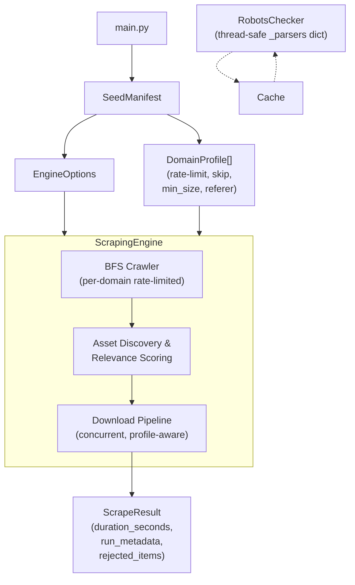

# scrAPE — Scraper for Archival & Production Extraction

**Batch media scraper** for crawling domains, discovering image/video assets, filtering for relevance, and downloading results.

---

## Features

- **Seed Manifest Parser** — Declarative domain profiles with `Rate-limit`, `skip-link-discovery`, `type`, `crawl`, `depth`, `min_image_size`, `thumbnail_prefix_pattern`, `requires_referer`
- **BFS Crawler** — Breadth-first page discovery with configurable depth & page limits
- **Concurrent Download Pipeline** — Multi-worker download pool with per-domain rate limiting and profile-aware settings (referer, min size, thumbnail rejection)
- **Quality Filters** — Relevance scoring (keyword + entity tokens), low-res detection (query params & URL path patterns), archive/index page penalty, preview marker detection, CDN whitelist
- **Memory-Backed Dedup** — Inline duplicate rejection (same URL+reason suppressed) via thread-safe `add_rejected()` closure
- **Audit Trail** — `rejected_items` list with reason + score; `run_metadata` + `duration_seconds` on each `ScrapeResult`
- **Robots.txt Respect** — Thread-safe parser cache; optional `--ignore-robots` flag
- **Crawl4AI Fallback** — When primary HTTP requests fail, falls back to JS-rendered crawling via Crawl4AI
- **Export** — JSON manifest output per run

---

## Quick Start

```bash
# Install dependencies
pip install -r requirements.txt

# Run with keyword and seed file
python main.py --keyword example_subject --seed seeds/example_subject.txt

# Run with entity tokens for higher precision
python main.py --keyword example_subject --seed seeds/example_subject.txt --entity-token "Entity Name" --entity-token "keyword"

# Run with explicit output (faster, no CLI wizard)
python main.py --keyword example_subject --seed seeds/example_subject.txt --max-results 30 --page-limit 50 --crawl-depth 2
```

See [USAGE.md](docs/USAGE.md) for full CLI reference.

---

## Seed Manifest Format

Each `.txt` seed file defines one subject with per-domain profiles. Annotations before a URL line apply to that domain.

### Supported Annotations

```text
# type: <media|crawl>    — Media type hint + crawl strategy
# depth: <int>           — BFS crawl depth override (default 2)
# Rate-limit: <float>    — Requests per second (default engine)
# skip-link-discovery    — Skip link discovery (fetch known URLs only)
# [CDN] <domain>         — Whitelist CDN domain (bypasses page relevance penalty)
# Alt-Subject: <string>  — Alternative subject name (for broader matching)
```

### Per-Domain Profile Fields

 | Field | Type | Description |
 | --- | --- | --- |
 | `min_image_size` | `int` | Minimum image dimension (px) — smaller skipped |
 | `thumbnail_prefix_pattern` | `str` | Regex — matching URLs are rejected as thumbnails |
 | `requires_referer` | `bool` | Send `Referer` header during download |

These fields are set programmatically in `seed_manifest.py` via `DomainProfile` attributes (not parsed from annotations yet).

### Example

```text
# Subject: Example Subject
# Alt-Subject: Example / Subject Alt

# ---------------------------------------------------------------------------
# gallery.example.com
# ---------------------------------------------------------------------------
# type: image | crawl: direct
https://gallery.example.com/subject
https://gallery.example.com/search?q=subject

# ---------------------------------------------------------------------------
# videos.example.org
# ---------------------------------------------------------------------------
type: video | crawl: index→detail
depth: 1
# Rate-limit: 0.4 req/s
# [CDN] cdn.example.org
https://videos.example.org/subject
```

> **Note**: Comment-style annotations (`# type:`, `# Rate-limit:`) are parsed from lines starting with `#`. Bare annotations (no `#`) are reserved for in-line overrides. See [seed_manifest.py](src/core/seed_manifest.py) for the full parser.

---

## Quality Filter Pipeline

Assets discovered during crawling pass through a multi-stage filter before being kept or rejected:

1. **Relevance scoring** — Weighted against keyword + entity tokens via `weighted_subject_score()`
2. **Low-resolution detection** — `has_low_res_query_param()` (query params) + `has_low_res_path_pattern()` (URL path dims, resizer paths, single-dim suffixes)
3. **Archive/index page penalty** — Assets on archive/index pages are penalized (low-info pages)
4. **Preview marker penalty** — URL/context containing thumbnail preview markers (e.g., `_th`, `thumb`, `preview`)
5. **Placeholder asset rejection** — Generic placeholder paths (/media/, /uploads/) with no subject keywords
6. **CDN bypass** — Assets on registered CDN domains bypass page-level penalties

See [docs/QUALITY_FILTERS.md](docs/QUALITY_FILTERS.md) for full details.

---

## Architecture Overview



- `main.py` — Entry point, CLI args, run loop
- `src/core/seed_manifest.py` — Parser: SeedManifest → list[DomainProfile]
- `src/core/engine.py` — ScrapingEngine: BFS crawl + scoring + download orchestration
- `src/core/filters.py` — `score_image_relevance()`, `score_video_relevance()`, `rejection_reason_for_*()`, `has_low_res_*()`, `safe_join()`
- `src/storage/file_downloader.py` — `download_file()`: HTTP fetch with retries, referer, min-size, thumbnail filtering
- `src/utils/robots.py` — `RobotsChecker`: per-domain parser cache (thread-safe), `--ignore-robots`

---

## Output Structure

```text
output/
  {keyword_slug}/
    runs/
      {run_id}/
        manifest.json         # Full scrape result (scanned pages, assets, rejected list, metadata)
        pages/                # HTML snapshots (optional)
```

---

## License

MIT
