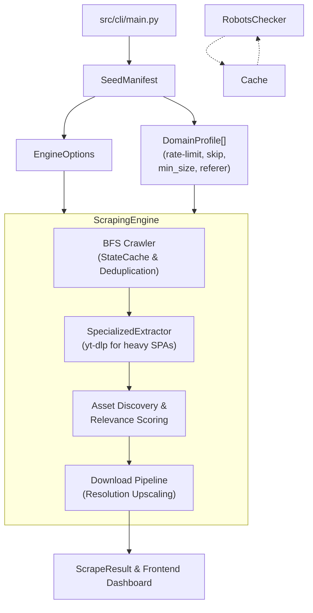

# scrAPE — Scraper for Archival & Production Extraction

      ██████  ▄████▄   ██▀███   ▄▄▄       ██▓███  ▓█████ 
    ▒██    ▒ ▒██▀ ▀█  ▓██ ▒ ██▒▒████▄    ▓██░  ██▒▓█   ▀ 
    ░ ▓██▄   ▒▓█    ▄ ▓██ ░▄█ ▒▒██  ▀█▄  ▓██░ ██▓▒▒███   
      ▒   ██▒▒▓▓▄ ▄██▒▒██▀▀█▄  ░██▄▄▄▄██ ▒██▄█▓▒ ▒▒▓█  ▄ 
    ▒██████▒▒▒ ▓███▀ ░░██▓ ▒██▒ ▓█   ▓██▒▒██▒ ░  ░░▒████▒
    ▒ ▒▓▒ ▒ ░░ ░▒ ▒  ░░ ▒▓ ░▒▓░ ▒▒   ▓▒█░▒▓▒░ ░  ░░░ ▒░ ░
    ░ ░▒  ░ ░  ░  ▒     ░▒ ░ ▒░  ▒   ▒▒ ░░▒ ░      ░ ░  ░
    ░  ░  ░  ░          ░░   ░   ░   ▒   ░░          ░   
          ░  ░ ░         ░           ░  ░            ░  ░
             ░                                           

**Batch media scraper** for crawling domains, discovering image/video assets, filtering for relevance, and downloading results.

---

## Features

- **Seed Manifest Parser** — Declarative domain profiles with `Rate-limit`, `skip-link-discovery`, `type`, `crawl`, `depth`, `min_image_size`, `thumbnail_prefix_pattern`, `requires_referer`, `cloudflare`, `max_pages`
- **Continuous Watchdog** — Long-running agent mode (`monitor_agent.py`) with persistent URL state caching (`StateCache` via SQLite) to prevent redundant processing.
- **Concurrent Download Pipeline** — Multi-worker download pool with parallelized CDN rate-limiting bypass, independent fast (5 req/s) non-CDN downloader limiters, and profile-aware settings. Supports resumable HTTP `Range` requests (HTTP 206 Partial Content) to resume interrupted downloads of large assets, with automatic fallback for HTTP 200/416, and post-download hash verification.
- **Specialized Extractors** — Zero-DOM direct extraction for complex SPAs like YouTube, TikTok, and Reddit via `yt-dlp` bypassing rendering completely.
- **Yield Tuning & Upscaling** — Heuristically predicts and fetches high-res origin URLs from standard thumbnail patterns (e.g. WordPress, Twitter) with automatic graceful degradation.
- **Quality Filters** — Relevance scoring, low-res detection, archive/index page penalty, preview marker detection, CDN whitelist. Includes early low-res directory structure path pre-filtering to avoid fetching thumbnails.
- **WAF & JS Challenge Bypass** — Integrated local cookie harvesting, Crawl4AI, DrissionPage, and an ultimate `undetected-chromedriver` (UC) Tier-3 fallback to decisively defeat Cloudflare Turnstile. Features WAF & Auth Wall Cutoff Circuit Breakers (consecutive failure/redirect thresholds) to prevent resource exhaustion.
- **Dynamic HTMX Frontend** — A fully decoupled, responsive live command center in `frontend/`. Monitors live OS hardware usage, offers process abort controls, and features physical file management directly inside the dashboard gallery (open local folder, delete files) via HTMX.
- **JSON-Driven URL Normalisation** — Domain-specific URL canonicalisation rules live in `data/url_normalisation_rules.json`. No domain patterns are hardcoded in source.
- **Memory-Backed Dedup & Cache** — Inline duplicate rejection via thread-safe closures and persistent cross-session SQLite URL caching (`--use-state-cache`), optimized with WAL for high concurrency.
- **Robots.txt Respect** — Thread-safe parser cache; optional `--ignore-robots` flag.
- **Export** — JSON manifest output per run, plus automated GitHub Pages deployment configuration.

---

## Quick Start

### Global CLI Installation
You can install scrAPE globally to run the interactive selection dashboard from any terminal window using the `scrape` command:

1. **Run the One-Click Installer**:
   - **Windows**: Double-click or run `.\install.bat` from the root of the project.
   - **macOS/Linux**: Run `pip install -e .` from the root of the project.
2. **Launch the CLI**:
   Open a new terminal window and run:
   ```bash
   scrape
   ```
   *Note: On the first run, the tool will automatically check and download Node.js dependencies (`npm install` for crawlee_bridge) and Playwright browser binaries (`playwright install chromium`) if they are missing.*

### Manual Execution (Without Global Install)
```bash
# Install dependencies
pip install -r requirements.txt

# Start the interactive WebUI Command Center
.\run_frontend.bat

# Run with keyword and seed file
python src/cli/main.py --keyword example_subject --seed seeds/example_subject.txt

# Run with entity tokens for higher precision
python src/cli/main.py --keyword example_subject --seed seeds/example_subject.txt --entity-token "Entity Name" --entity-token "keyword"

# Run with explicit output (faster, no CLI wizard)
python src/cli/main.py --keyword example_subject --seed seeds/example_subject.txt --max-results 30 --page-limit 50 --crawl-depth 2
```

See [USAGE.md](docs/USAGE.md) for full CLI reference and [CONFIGURATION.md](docs/CONFIGURATION.md) for detailed annotation and dynamic settings reference.

---

## WAF, Turnstile & JS-Only Bypass (Local & Server Modes)

scrAPE is equipped with a tiered fallback pipeline to defeat Cloudflare WAF, Turnstile challenges, login walls, and JS-only rendering locally without relying on expensive cloud proxies. It works on **Windows, macOS, and Linux**.

On Linux environments without a display (headless servers), Xvfb is recommended for the deep stealth tiers, and the `--capsolver-key` flag is supported to automatically solve Turnstile blocks that cannot be bypassed via human interaction.

1. **Local Cookie Harvesting** (`browser-cookie3`) — Reads active login and session cookies from local profiles of Chrome, Firefox, Edge, Brave, and Opera. Reuses them to authenticate direct `httpx` client requests. Harvested session cookies are securely stored with restricted file permissions (`0o600`).
2. **Crawlee (Cheerio)** — Fast static fallback utilizing `got-scraping` Node.js headers to perfectly spoof standard browser TLS fingerprints. (Runs securely isolated on `127.0.0.1`).
3. **Crawl4AI Headless/Headful Browser** — Executes standard headless browser-based requests.
4. **DrissionPage Automation Fallback** — A robust Chromium-based controller that handles light JS walls and Captchas.
5. **Crawlee (Puppeteer)** — Heavy JS-rendering fallback powered by the `puppeteer-extra-plugin-stealth` library for maximum bot evasion.
6. **Helium** — High-level automation fallback.
7. **Undetected-Chromedriver (UC) Fallback** — The ultimate stealth fallback layer. Specifically engineered to seamlessly bypass persistent Cloudflare Turnstile blocks with careful process-tree lifecycle management to avoid zombie chrome instances during continuous runs.

### Configuration Settings

These features can be controlled globally in `src/config.py`:

- `ENABLE_COOKIE_HARVESTING = True`
- `ENABLE_DRISSIONPAGE_FALLBACK = True`

---

## Seed Manifest Format

Each `.txt` seed file defines one subject with per-domain profiles. Annotations before a URL line apply to that domain.

### Supported Annotations

Comment-style annotations (`# <key>: <value>`) immediately preceding a domain/URL block configure that domain's extraction rules:

| Annotation | Example | Description |
| --- | --- | --- |
| `# type: <video\|image\|mixed>` | `# type: image` | Media type hint + crawl strategy |
| `# crawl: <direct\|index→detail>` | `# crawl: direct` | Use `direct` to skip link discovery and scrape matching URLs only |
| `# depth: <int>` | `# depth: 1` | BFS crawl depth override (default 1 for index, 0 for direct) |
| `# Rate-limit: <float> req/s` | `# Rate-limit: 0.5 req/s` | Requests per second throttle for this domain |
| `# max_pages: <int>` | `# max_pages: 5` | Hard cap on pages crawled for this domain per run. Skips excess pages before any HTTP request. |
| `# cloudflare: true` | `# cloudflare: true` | Marks domain as Cloudflare Turnstile-protected. Skips all Crawl4AI fallback tiers immediately on 403/429. |
| `# skip-link-discovery` | `# skip-link-discovery` | Skip crawling/link discovery entirely |
| `# [CDN] <hostname>` | `# [CDN] cdn.domain.com` | Whitelist CDN domain (bypasses page-level penalties) |
| `# min_image_size: WxH` | `# min_image_size: 800x600` | Minimum accepted image dimensions (width x height) |
| `# thumbnail_prefix: <pattern>` | `# thumbnail_prefix: /thumbs/` | String pattern to reject thumbnail URLs early |
| `# requires_referer` | `# requires_referer` | Send page referer header during download to bypass hotlinking protection |

### Example

```text
# Subject: Example Subject
# Alt-Subject: Example / Subject Alt

# ---------------------------------------------------------------------------
# gallery.example.com
# ---------------------------------------------------------------------------
# type: image | crawl: direct
# min_image_size: 1000x800
# thumbnail_prefix: /thumbs/
https://gallery.example.com/subject
https://gallery.example.com/search?q=subject

# ---------------------------------------------------------------------------
# videos.example.org
# ---------------------------------------------------------------------------
# type: video | crawl: index→detail
# depth: 1
# Rate-limit: 0.4 req/s
# [CDN] cdn.example.org
# requires_referer
https://videos.example.org/subject
```

---

## Quality Filter Pipeline

Assets discovered during crawling pass through a multi-stage filter before being kept or rejected:

1. **Relevance scoring** — Weighted against keyword + entity tokens via `weighted_subject_score()`
2. **Low-resolution detection** — `has_low_res_query_param()` (query params) + `has_low_res_path_pattern()` (URL path dims, resizer paths, single-dim suffixes)
3. **Archive/index page penalty** — Assets on archive/index pages are penalized (low-info pages)
4. **Preview marker penalty** — URL/context containing thumbnail preview markers (e.g., `_th`, `thumb`, `preview`)
5. **Placeholder asset rejection** — Generic placeholder paths (/media/, /uploads/) with no subject keywords
6. **CDN bypass** — Assets on registered CDN domains bypass page-level penalties

See [docs/QUALITY_FILTERS.md](docs/QUALITY_FILTERS.md) for full details.

---

## Architecture Overview



- `src/cli/main.py` / `src/cli/monitor_agent.py` — Entry points, CLI wizards, continuous watchdog loops
- `src/core/seed_manifest.py` — Parser: SeedManifest → list[DomainProfile]
- `src/core/engine.py` — ScrapingEngine: Main orchestration entry point
- `src/core/managers.py` — DomainRulesManager, MediaProcessor, CrawlOrchestrator
- `src/scraper/specialized.py` — `SpecializedExtractor`: yt-dlp based heavy SPA extraction
- `src/core/filters.py` — `score_image_relevance()`, `transform_to_highres()`, `rejection_reason_for_*()`
- `src/storage/file_downloader.py` — `download_file()`: Concurrent fetching with transparent high-res fallback
- `src/storage/state_cache.py` — Persistent URL history using SQLite
- `frontend/app.py` — FastApi + HTMX WebUI dashboard and process orchestrator

---

## Post-Run Observability

Every crawl run generates an automated post-run metrics summary at `output/{keyword_slug}/runs/{run_id}/run_summary.json`. This provides detailed visibility into crawler performance, yield, and failures:

- **Runtime Breakdown** — Exact timing of the BFS crawl phase vs the media download phase.
- **Yield Stats** — Total pages scanned, images/videos kept, rejections, and download success/fail/skip counts.
- **Domain Breakdown** — Granular per-domain counters for pages scanned, media kept, rejected items, duplicate hash skips, and wasted (failed) requests.
- **Top Rejection Reasons** — Frequency counts of why URLs were rejected (e.g. low resolution, duplicates, etc.).
- **Zero-Yield Domain List** — Allowed/scanned domains that had $>0$ pages crawled but 0 kept images or videos.
- **Dead Download Links** — Listing of specific media URLs that failed to download, including source pages and exact failure reasons (e.g. 404, HTTP error).

The summary is printed to the console at the end of every run, and stored in JSON format for easy programmatic ingestion.

---

## System Limitations & Defeated Challenges

| Challenge / Limitation | Status | Resolution / Workaround |
| --- | --- | --- |
| **Cloudflare Turnstile & WAFs** | **DEFEATED** | Bypassed natively on Windows/Mac via headful browser spawning, or fully headless on Linux via `--capsolver-key` API integration. |
| **JS-Only / SPA Pages** | **DEFEATED** | Fully rendered via Crawlee (Puppeteer) and `yt-dlp` specialized extractors. |
| **Auth-Walled Sources** | **DEFEATED** | Bypassed via Local Cookie Harvesting (`browser-cookie3`) and manual `--inject-cookies` / `--login` CLI flags. |
| **IP Rate-Limiting / Bans** | **Limitation** | The scraper runs locally on a single IP without proxy rotation. If aggressively banned, use `--proxy-list` to route through proxies. |
| **Manual CAPTCHAs** | **DEFEATED (Opt-In)** | Passed automatically if `--capsolver-key` is supplied; otherwise pauses execution to allow manual interaction in GUI mode. |

---

## Data Files

| File | Purpose |
| --- | --- |
| `data/domain_config.json` | Rate limits, hotlink-protected domains, referer overrides, deep-scrape targets |
| `data/url_normalisation_rules.json` | URL canonicalisation rules (regex → replacement). Loaded at startup into `config.URL_NORMALISATION_RULES`. Add new domain-specific URL collapse rules here. |
| `data/blacklist.json` | Domains auto-banned by the circuit breaker. Review after each run — remove false positives. |
| `data/sessions/` | Persisted cookie jars per domain. Usually leave untouched. |

---

## Output Structure

```text
output/
  cache/
    state_cache.db      # Persistent SQLite cache of processed URLs
  {keyword_slug}/
    runs/
      {run_id}/
        results.json          # Full scrape result (scanned pages, assets, rejected list, metadata)
        run_summary.json      # Structured post-run observability metrics and summaries
        domain_report.json    # Per-domain crawl count dictionary
        images/               # Downloaded image files grouped by domain
        videos/               # Downloaded video files grouped by domain
```
