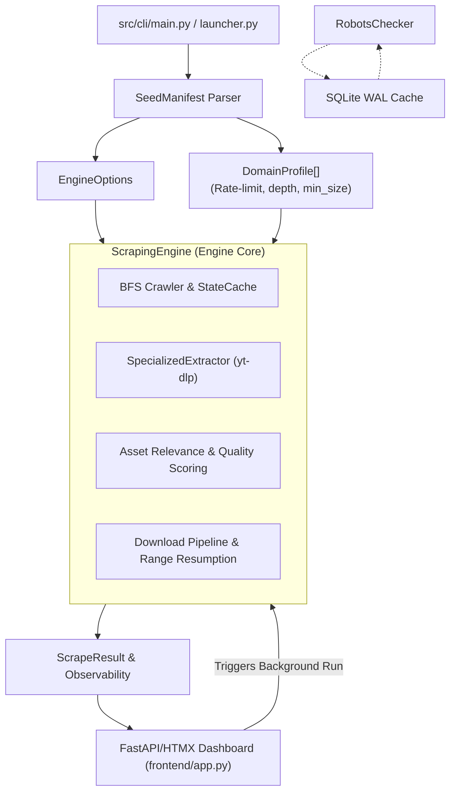

# scrAPE — Scraper for Archival & Production Extraction

<p align="center">
  
</p>

<p align="center">
  
  
  
  
  
</p>

**scrAPE** is an *autonomous media extraction & stealth crawl engine* that runs locally on your machine — built for domain crawling, high-throughput asset discovery, WAF bypass, and AI dataset curation. Powered by a decoupled **FastAPI + HTMX** tactical WebUI, an 8-tier WAF fallback pipeline, and persistent SQLite WAL state caching, scrAPE handles complex single-page applications (SPAs), Cloudflare Turnstile protections, and high-concurrency downloads with real-time memory-aware `HardwareLoadGovernor` telemetry.

If you want a local, fast, stealth-resilient web scraper that feels responsive, controllable, and always-on, this is it.

<p align="center">
  <a href="#quick-start">Quick Start</a> •
  <a href="#key-features">Key Features</a> •
  <a href="#waf-turnstile--js-only-bypass">WAF Bypass</a> •
  <a href="#seed-manifest-format">Seed Manifests</a> •
  <a href="#architecture-overview">Architecture</a> •
  <a href="#documentation">Documentation</a>
</p>

---

### 1. Unified Master Launcher (Recommended)

Launch the interactive master menu (or pass flags directly):

- **Windows**: Run `.\run.bat` from the repository root.
- **macOS / Linux**: Run `./run.sh` from the repository root.

```powershell
# Interactive Master Launcher (Menu: WebUI, Wizard, Auth Login, Autostart, Install)
.\run.bat

# Direct CLI Scrape Execution
.\run.bat --keyword "<subject>" --seed-file seeds/<subject>.txt --download-media

# Continuous Watchdog Monitoring Agent
.\run_monitor.bat --keyword "<subject>" --use-state-cache
```

```bash
scrape
```

> *Note: On initial launch, missing dependencies (`crawlee_bridge` Node.js modules and Playwright Chromium binaries) are detected and installed automatically.*

### 2. Standalone Terminal Launch

```bash
# Install Python dependencies
pip install -r requirements.txt

# Start the interactive WebUI Command Center (http://localhost:10001)
.\run_frontend.bat

# Or run via CLI with a keyword and seed file
python src/cli/main.py --keyword <subject> --seed-file seeds/<subject>.txt

# Production run with custom concurrency & downloading
python src/cli/main.py --keyword <subject> --seed-file seeds/<subject>.txt --max-results 0 --page-limit 0 --workers 12 --dl-workers 16 --download-media --headless
```

---

## Key Features

- **Dynamic HTMX Tactical WebUI & Canvas Physics Visualizer** — Fully decoupled dashboard (`frontend/`) featuring an interactive HTML5 Canvas crawl network tree (`#crawl-graph-canvas`) with force-directed spring physics, search filters, depth controls, Node Inspector drawer, context-aware telemetry stat cards, real-time hardware telemetry (CPU, RAM, Disk), process controls, and dual speed limiters.
- **WAF & Turnstile 8-Tier Fallback + Universal Captcha Auto-Solving** — Defeats Cloudflare Turnstile, reCAPTCHA v2/v3, hCaptcha, Auth walls, and anti-bot protections using an 8-tier escalation chain (`Local Cookies` → `Crawl4AI` → `Crawlee Cheerio` → `DrissionPage` → `Crawlee Puppeteer` → `Helium` → `undetected-chromedriver` → `Camoufox` → `FlareSolverr`) with per-host preferred engine learning (`_preferred_engine_by_host`) and automated token injection via `CapSolver`, `2Captcha`, or `AntiCaptcha`.
- **Strict Structural Path-Injection Security** — Robust filesystem protections ensuring absolute paths are programmatically validated against untainted OS-derived drive/root prefixes (`os.path.splitdrive`), natively fulfilling stringent CodeQL static analysis constraints without requiring exception flags or suppressions.
- **Pluggable Multi-Channel Webhook Notifier Architecture** - Extensible `BaseNotifier` framework supporting Telegram Bot alerts (`src/notifications/telegram_bot.py`), Discord rich embeds (`#00ff66` completion, `#ff5500` WAF alerts), Slack Block Kit JSON, and generic Custom Webhooks (Apprise, N8N, Zapier, Matrix, Pushover) with POST `/api/notifications/test` endpoint.
- **AI Dataset Auto-Tagging & Multi-Stage Quality Export** — Hybrid vision model auto-tagger (`DatasetTagger`) with opt-in WD14 Booru ViT classification (`landscape`, `portrait`, `highres`), paired with `KohyaDatasetExporter` Stage 3 Aesthetic Quality Gate (`min_aesthetic_score: float = 5.5`), 64-bit perceptual `dHash` near-duplicate filtering (Hamming distance $\le 4$), min resolution filter ($\ge 512\text{px}$), and WebUI LoRA Export modal aesthetic controls.
- **HardwareLoadGovernor & Dual Speed Limiters** — Dynamic system RAM & CPU monitoring that overrides the pipeline's concurrency factor (scales 1x to 3x) and forces garbage collection under load. Plus Token-Bucket rate-limiting on outgoing page requests (`--rate-limit` / `RPS`) paired with network bandwidth throttling on media asset downloads (`--dl-speed-limit` / `KBPS`), accessible via WebUI and CLI.
- **Vector Branding & System Tray Runner** — Embedded SVG vector artwork across web and terminal interfaces, zero-dependency inline SVG favicon loading, and a custom hand-crafted high-contrast PIL system tray runner (`src/cli/launcher.py`, RGBA 64×64) tuned for taskbar legibility.
- **FlareSolverr Docker Auto-Start & Session Reuse** — Native binding to `http://127.0.0.1:8191/v1` with automatic background Docker container launch (`docker start flaresolverr`) and host session cookie enrichment for downstream CDN streaming media.
- **High-Resolution URL Transformation Heuristics** — Automatic path transformations for Erome (`/t/` / `/th/` → `/v/`), WordPress (`-scaled.jpg` stripping), Twitter (`name=large`), and WordPress dimension patterns (`-1024x768.png`).
- **Low & Zero-Yield Domain Cutoff Policy** — Automated host filtering that halts crawling on unseeded external domains hitting 15 pages with 0 yield, 20+ pages with <5% yield, or 3 consecutive WAF errors.
- **Resumable Crawl & Download Checkpointing** — Persistent SQLite queue and download state (`output/.crawl_state.sqlite`), paired with HTTP `Range` request byte resumption (HTTP 206 Partial Content) and per-host download semaphores (`_host_semaphore_for`).
- **Multi-Platform Extractor Plugins** — Zero-DOM direct extraction plugins for YouTube, TikTok, Reddit, Civitai, Danbooru/Gelbooru, Pinterest, and ArtStation.
- **Enterprise-Grade Security Compliance** — Resolves major static analysis warnings (OSV-Scanner, Semgrep, CodeQL) via strict structural path validation (`os.path.splitdrive` checking), mitigating path-injection natively without relying on superficial suppression comments.

---

## WAF, Turnstile & JS-Only Bypass

scrAPE features an 8-tier escalation pipeline to defeat Cloudflare WAF, Turnstile challenges, and JS-only rendering without expensive cloud proxy subscriptions:

| Tier | Engine / Method | Best Used For |
|---|---|---|
| **Tier 0** | **Local Cookie Harvesting** (`browser-cookie3`) | Reusing active browser session cookies from Chrome, Firefox, Edge, Brave |
| **Tier 1** | **Crawl4AI** | Standard headless browser page evaluation |
| **Tier 2** | **Crawlee (Cheerio)** | Fast static extraction with Node.js `got-scraping` TLS fingerprint spoofing |
| **Tier 3** | **DrissionPage** | Light JS challenges and basic Captcha bypass |
| **Tier 4** | **Crawlee (Puppeteer)** | Heavy JS-rendering with `puppeteer-extra-plugin-stealth` |
| **Tier 5** | **Helium** | High-level browser control fallback |
| **Tier 6** | **Undetected-Chromedriver (UC)** | Stealth layer for persistent Cloudflare challenges |
| **Tier 7** | **Camoufox** | C++ stealth Firefox engine with OS fingerprint matching & 20s Turnstile escalation |
| **Tier 8** | **FlareSolverr** | Dedicated solver service integration (`127.0.0.1:8191`) with Docker auto-start, domain session reuse & proxy forwarding |

---

## Seed Manifest Format

Each `.txt` seed file defines extraction rules per domain using comment annotations (`# <key>: <value>`):

| Annotation | Example | Description |
|---|---|---|
| `# type: <video\|image\|mixed>` | `# type: image` | Media type hint & extraction strategy |
| `# crawl: <direct\|index→detail>` | `# crawl: direct` | Use `direct` to skip link discovery and scrape target URLs only |
| `# depth: <int>` | `# depth: 1` | BFS crawl depth override (default 1 for index, 0 for direct) |
| `# Rate-limit: <float> req/s` | `# Rate-limit: 0.5 req/s` | Requests-per-second throttle for domain |
| `# max_pages: <int>` | `# max_pages: 10` | Hard cap on pages crawled per domain per run |
| `# cloudflare: true` | `# cloudflare: true` | Skips light tiers on 403/429, escalating directly to stealth browsers |
| `# skip-link-discovery` | `# skip-link-discovery` | Skip crawling/link discovery entirely |
| `# [CDN] <hostname>` | `# [CDN] cdn.domain.com` | Whitelist CDN domain (bypasses page-level penalties) |
| `# min_image_size: WxH` | `# min_image_size: 1000x800` | Minimum accepted image dimensions |
| `# thumbnail_prefix: <pattern>` | `# thumbnail_prefix: /thumbs/` | String pattern to reject thumbnail URLs early |
| `# requires_referer` | `# requires_referer` | Send page Referer header to bypass hotlinking protection |

---

## Parameter Recommendations & Safety Guardrails

To preserve system responsiveness and avoid CDN IP rate limits (HTTP 429/503):

| Parameter | Recommended (Safe) | High-Performance | Over-Limit Warning | Risk / System Impact |
|---|---|---|---|---|
| **Scraper Workers** (`--workers`) | **4 – 8** | **12 – 16** | **> 16 workers** | High CPU/RAM utilization, browser process stalls |
| **Download Workers** (`--dl-workers`) | **4 – 8** | **12 – 16** | **> 24 workers** | Bandwidth saturation, CDN IP bans (429/503) |
| **Crawl Depth** (`--crawl-depth`) | **1 – 2** | **3 levels** | **> 4 levels** | Exponential link graph explosion |
| **Max Results** (`--max-results`) | **50 – 200** | **500 – 1000** | **0 (Unlimited)** | High disk usage (GBs of video storage) |
| **Page Limit** (`--page-limit`) | **20 – 50** | **100 – 200** | **0 (Unlimited)** | Unbounded network traffic, extended job duration |

---

## Architecture Overview


```mermaid
flowchart TD
    CLI["src/cli/main.py / launcher.py"] --> SM["SeedManifest Parser"]
    SM --> DP["DomainProfile[]<br/>(Rate-limit, depth, min_size)"]
    SM --> EO["EngineOptions"] --> SE["ScrapingEngine"]
    DP --> SE

    subgraph SE["ScrapingEngine (Engine Core)"]
        BF["BFS Crawler &amp; StateCache"]
        SPE["SpecializedExtractor (yt-dlp)"]
        AS["Asset Relevance &amp; Quality Scoring"]
        DLP["Download Pipeline &amp; Range Resumption"]
    end

    RC["RobotsChecker"] -.-> C["SQLite WAL Cache"]
    C -.-> RC

    FD["FastAPI/HTMX Dashboard (frontend/app.py)"]
    SE --> SR["ScrapeResult &amp; Observability"] --> FD
    FD -- Triggers Background Run --> SE
```

### Module Layout

| Directory / File | Description |
|---|---|
| `frontend/app.py` | FastAPI backend for HTMX WebUI, context-aware stats, disk asset counter, live OS telemetry & process orchestrator |
| `frontend/templates/` | Brutalist HTMX dashboard templates (`index.html`, `gallery.html`) with vector logo and inline SVG favicon |
| `crawlee_bridge/` | Express.js bridge running Crawlee Cheerio and Puppeteer stealth tiers |
| `src/cli/launcher.py` | Interactive CLI launcher & system tray manager (custom PIL RGBA 64×64 icon renderer) |
| `src/cli/cli_wizard.py` | Interactive wizard for standard crawls, watchdog runs, and dataset formatting |
| `src/core/engine.py` | Core `ScrapingEngine` orchestration entry point |
| `src/core/managers.py` | Decoupled `CrawlOrchestrator`, `MediaProcessor`, and `DomainRulesManager` |
| `src/core/filters.py` | Relevance scoring, low-res detection, and rejection reason algorithms |
| `src/storage/file_downloader.py` | Multi-threaded media fetcher with Range resumption and Pillow image sanitization |
| `src/storage/state_cache.py` | Persistent URL history using SQLite in WAL journal mode |
| `Dockerfile` | Container build instructions for Playwright/Node.js compatibility |
| `docker-compose.yml` | Multi-container orchestration (Scraper + FlareSolverr) |
| `docs/SECURITY.md` | Security policies and static analysis compliance |

---

## Post-Run Observability

Every crawl generates an automated observability report at `output/{keyword_slug}/runs/{run_id}/run_summary.json`:

- **Phase Timing Breakdown** — BFS crawl duration vs media download duration.
- **Yield Statistics** — Pages scanned, kept assets, rejected items, download success/fail/skip counts.
- **Domain Metrics** — Granular per-domain counters for pages scanned, media kept, rejected items, and duplicate hash skips.
- **Rejection Diagnostics** — Frequency table of rejection reasons (e.g. `low_resolution`, `archive_penalty`, `duplicate_hash`).
- **Zero-Yield Domain Tracking** — Identifies domains with >0 scanned pages but 0 kept assets.
- **Failed Link Audit** — Exact list of failed download URLs with HTTP status codes and error tracebacks.

---

## Output Directory Structure

```text
output/
├── cache/
│   └── state_cache.db           # Persistent SQLite WAL cache of processed URLs
└── {keyword_slug}/
    └── runs/
        └── {run_id}/
            ├── results.json     # Complete scrape result manifest
            ├── run_summary.json # Observability metrics & execution summary
            ├── domain_report.json
            ├── images/          # Downloaded image assets
            └── videos/          # Downloaded video assets
```

---

## Documentation

Detailed documentation is available in the [`docs/`](docs/) directory:

- [Usage Guide](docs/USAGE.md) — CLI options, WebUI controls, and AI dataset tools
- [Architecture Guide](docs/ARCHITECTURE.md) — Internal data flow, dynamic plugins, and thread models
- [Configuration Reference](docs/CONFIGURATION.md) — Seed annotations, `config.py` settings, and normalisation rules
- [Quality Filters Reference](docs/QUALITY_FILTERS.md) — Scoring formulas, low-res patterns, and rejection rules
- [Security Policy](docs/SECURITY.md) — Vulnerability mitigations, OSV-Scanner checks, and static analysis compliance
- [Changelog](docs/CHANGELOG.md) — Complete version release history

---

## License

Distributed under the **MIT License**. See [LICENSE](LICENSE) for more information.
