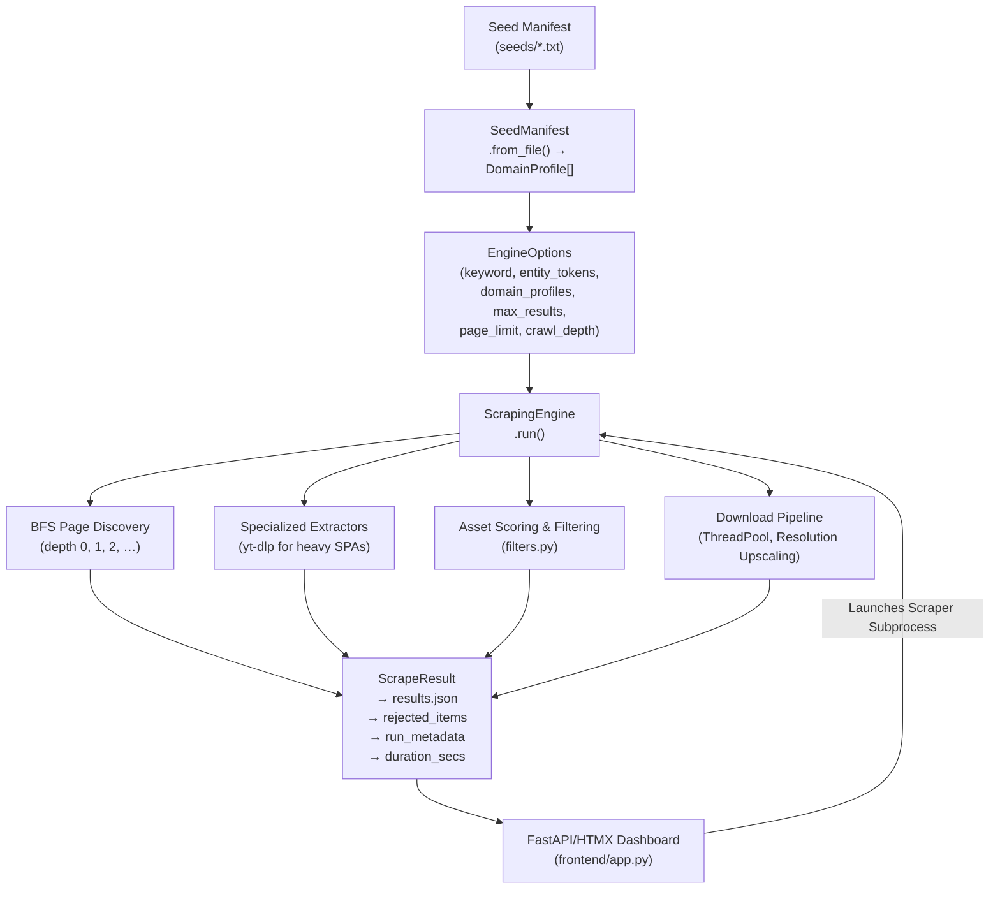
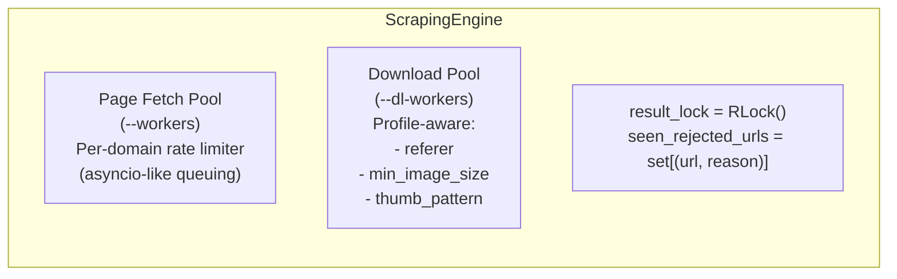

# Architecture — scrAPE

## 1. Data Flow



## 2. Module Layout

```text
seed.txt                         — Default literal seed (test/demo only)

crawlee_bridge/
├── index.mjs                    — Node.js Express server running Crawlee Cheerio/Puppeteer stealth modes
├── package.json                 — Node.js dependencies
└── crawlee_bridge.log           — Bridge server logs

frontend/
├── app.py                       — FastAPI backend for HTMX SPA, live OS telemetry & process orchestrator
└── templates/                   — HTMX-powered dashboard templates (index.html, gallery.html)

src/
├── __init__.py
├── cli/
│   ├── __init__.py
│   ├── main.py                  — CLI entry point, dry-run, run orchestration
│   ├── auth.py                  — Interactive headful login and cookie injection
│   ├── monitor_agent.py         — Watchdog entry point, continuous monitoring loop
│   ├── launcher.py              — Interactive launcher & system tray manager
│   └── cli_wizard.py            — Interactive wizard for standard & watchdog runs
├── core/
│   ├── __init__.py
│   ├── engine.py                — ScrapingEngine entry point
│   ├── managers.py              — CrawlOrchestrator, MediaProcessor, DomainRulesManager
│   ├── filters.py               — Relevance scoring, rejection reasons, low-res detection
│   ├── models.py                — ScrapeResult, RejectedItem, EngineOptions, DomainProfile
│   └── seed_manifest.py         — SeedManifest parser: annotations → DomainProfile[]
├── scraper/
│   ├── google_images.py         — Search provider & fallback page scraper
│   └── specialized.py           — SpecializedExtractor plugin loader
├── plugins/
│   ├── base.py                  — ExtractorPlugin interface
│   ├── reddit_extractor.py      — Reddit API extraction plugin
│   └── ytdlp_extractor.py       — YouTube/Generic video extraction plugin
├── storage/
│   ├── file_downloader.py       — FileDownloader: HTTP fetch with retries, size filter, upscaling
│   └── state_cache.py           — Persistent SQLite state cache (WAL optimized) to prevent redundant crawls
└── utils/
    ├── __init__.py
    ├── blacklist.py             — BlacklistManager: persistent 404/403/Cloudflare domains blacklist
    ├── crawlee_client.py        — CrawleeClient: Python HTTP wrapper to communicate with local Crawlee Node.js bridge
    ├── http_client.py           — HttpClient: connection pool, ratelimit, Crawlee, Crawl4AI, DrissionPage & UC fallbacks
    ├── robots.py                — RobotsChecker: per-domain thread-safe parser cache
    └── session.py               — SessionManager: persistent session cookies cache (secure file permissions)

tests/
├── test_advanced_features.py
├── test_audit_trail.py
├── test_cookie_persistence.py
├── test_download_retries.py
└── test_performance_quality_features.py

data/
├── domain_config.json           — Rate limits, hotlink-protected, referer overrides, deep crawl
└── url_normalisation_rules.json — URL canonicalisation rules compiled into config.URL_NORMALISATION_RULES

docs/
├── CHANGELOG.md
├── USAGE.md
├── ARCHITECTURE.md
├── QUALITY_FILTERS.md
└── SCENARIOS.md
```

## 3. Core Components

### 3.1 Seed Manifest (`seed_manifest.py`)

`SeedManifest.from_file()` reads a `.txt` seed file and produces a list of `DomainProfile` objects.

**Parser features:**

- Lines beginning with `# type:` → parsed as media type / crawl strategy annotation
- Lines beginning with `# Rate-limit:` → parsed as float req/s
- Lines beginning with `# skip-link-discovery` → flag set on domain profile
- Lines beginning with `[CDN]` → CDN whitelist entry
- All annotations preceding a URL belong to that domain's profile
- Unrecognized comment lines ignored

**DomainProfile fields:**

| Field | Source | Default |
| --- | --- | --- |
| `seed_urls` | URLs listed after annotations | `[]` |
| `media_type` | `# type:` annotation | `"mixed"` |
| `crawl_strategy` | `# crawl:` annotation | `"index→detail"` |
| `crawl_depth` | `# depth:` annotation | `None` (engine default) |
| `rate_limit` | `# Rate-limit: N req/s` | `None` |
| `skip_link_discovery` | `# skip-link-discovery` flag | `False` |
| `cloudflare_blocked` | `# cloudflare: true` flag | `False` — skips all Crawl4AI fallback tiers on 403/429 |
| `max_pages` | `# max_pages: N` annotation | `None` (unlimited) |
| `cdn_hosts` | `# [CDN] hostname` lines | `[]` |
| `min_image_size` | `# min_image_size: WxH` | `None` |
| `thumbnail_prefix_pattern` | `# thumbnail_prefix:` | `None` |
| `requires_referer` | `# requires_referer` flag | `False` |

### 3.2 Filter Pipeline (`filters.py`)

**`safe_join(items, sep)`** — Joins only non-None items; replaces all `" ".join([...])` calls in filter functions for `None`-safety.

**Relevance scoring** uses `weighted_subject_score()`:

- URL tokens get 3× weight
- Alt text tokens get 2× weight  
- Source page / page title tokens get 1× weight
- Entity tokens (keyword + additional) get 2× bonus when matched in high-weight fields

**Rejection reasons** (checked in order):

| Reason | When |
| --- | --- |
| `duplicate` | Same URL seen already (norm key collision) |
| `placeholder_asset` | Generic URL pattern with no subject keywords |
| `preview_or_thumbnail` | Preview markers detected (query param or path pattern) |
| `low_resolution_hint` | `has_low_res_query_param()` OR `has_low_res_path_pattern()` |
| `low_subject_relevance` | Below score threshold (image < 3, video < 2) |
| `archive_or_index` | Source page is archive/index AND low score; also CDN-bypassable |
| `max_results_limit` | Collection already full |

**Low-resolution path patterns** (`has_low_res_path_pattern()`):

- Double dimensions: `-150x150`, `_200x300`, `/150x150/`
- Resizer paths: `/resize/150/150/`, `/w_150,h_150/`, `/w_150/h_150/`
- Single dimension: `_150x.jpg` (width-based), `_x150.jpg` (height-based)
- Minimum thresholds: width < 400px, height < 300px

### 3.3 Scraping Engine (`engine.py`)

**Concurrency:**

- Page fetching: all queued pages submitted to `ThreadPoolExecutor`; per-domain `RateLimiter` ensures polite crawl. Concurrency scales dynamically based on pure network latency (tracked per-thread, excluding rate-limiter wait and sleep times), preventing unrelated slow domains from collapsing crawler speed.
- Downloading: all qualified items submitted to a separate `ThreadPoolExecutor` (configurable via `--dl-workers`). It utilizes a separate concurrency pool:
  - Whitelisted CDN hosts bypass downloader rate-limiting entirely.
  - Non-CDN hosts use independent, fast (5 req/s) per-domain download limiters rather than locking on crawl-phase limits.
- `result_lock` is an `RLock` (reentrant) — supports nested critical sections safely.

**WAF & Auth Wall Cutoff Circuit Breakers:**

- **Consecutive Failure Cutoff**: Tracks crawler worker failures on a per-domain basis. If a host triggers **3 consecutive request failures** (e.g. anti-bot blocking, page read timeout, network drops), the engine flags the host as failed in the active run. Remaining queued pages for that host are skipped instantly (`host_failed_skipped`) without spawning browser workers or hitting timeouts.
- **Auth Wall Redirect Cutoff**: If a page request gets redirected to a standard authentication path (matching `/login`, `/signin`, `/signup`, `/auth`), the engine flags the host as failed and immediately cancels further scans for that host.
- **WAF Pre-registration**: Domains flagged as Cloudflare-blocked are registered in the `HttpClient`'s fail-fast set at engine startup. When the engine encounters a 403 or 429 response from these domains during a crawl, it fails fast instead of wasting 30+ seconds attempting headless/headful browser fallback tiers.

**Domain-level page cap (`max_pages`):**

If a `DomainProfile` has `max_pages` set, `_fetch_page()` checks `pages_scanned >= max_pages` before making any HTTP request and returns `"max_pages_capped"` immediately. Prevents over-crawling of low-yield domains.

**Deduplication:**

- Global `add_rejected(kind, url, source_page, reason, score)` closure — dedup by `(url, reason)` tuple via `seen_rejected_urls` set. Same URL+reason only logged once.

**Video resolution hint:**

- `_video_resolution_hint(url)` — extracts numeric resolution from URL path (e.g. `_1080p`, `_720p`) via regex `[_\-/](\d{3,4})p`

### 3.4 Download Pipeline (`file_downloader.py`)

`_download_file(url, directory, stem, media_kind, referer=None, min_image_size=None, thumbnail_prefix_pattern=None, cdn_hosts=None)`:

1. If `min_image_size` set and media is image: skip if size < threshold.
2. If `thumbnail_prefix_pattern` set: skip if URL matches pattern (thumbnail heuristic).
3. Determine rate-limiting strategy:
   - If the URL's hostname is in `cdn_hosts`, skip rate-limiting entirely.
   - Otherwise, route through the independent, fast download-phase rate limiter (5 req/s).
4. **Resumable range requests check**: If target is a video and a corresponding `.tmp` file is present in the download directory, check `bytes_written = temp_file.stat().st_size`. If greater than zero, injects the `Range: bytes={bytes_written}-` HTTP header to resume downloading.
5. HTTP fetch with retry (`tenacity`).
6. **Range response handling**:
   - If response is `206 Partial Content`, open the `.tmp` file in append binary (`"ab"`) mode and append streaming chunks.
   - If response is `200 OK` (server doesn't support Range requests), truncate and open the `.tmp` file in write binary (`"wb"`) mode, downloading from scratch.
   - If response is `416 Range Not Satisfiable` (corrupted or invalid offset), delete the `.tmp` file and raise a retry exception to download from scratch.
7. Dimension extraction (HEAD request + PIL if needed).
8. Skip on: < configured min size, unparseable dimensions, invalid media type.
9. **Image Sanitization:** For images, intercepts the byte stream into memory and re-encodes via Pillow to strip EXIF data (GPS, camera info) and block malformed/polyglot payloads.
10. **Post-Download Hashing**: Hashing (SHA-256) is calculated directly from the written file on disk once the stream completes successfully, ensuring correct checksum integrity regardless of connection drops and resumption points.

### 3.5 Robots Checker (`robots.py`)

`RobotsChecker` maintains a per-domain parser cache (`self._parsers` dict) instead of `@lru_cache` for thread safety. To prevent temporary or transient robots.txt blocks from building up failure counts and triggering domain-wide cooldowns, a successful robots.txt fetch immediately records success on the domain's cooldown state, resetting the error count.

### 3.6 Main Entry (`src/cli/main.py`)

- Captures `time.monotonic()` start → end → `duration_seconds` on result
- Stores `run_metadata` dict with: `seed_file`, `workers`, `dl_workers`, `page_limit`, `crawl_depth`, `max_results`, `entity_tokens`, `download_media`

### 3.7 Blacklist Manager (`blacklist.py`)

Provides a system to track domains that consistently return HTTP 404, 403, or trigger Cloudflare blocks, ensuring that subsequent HTTP client requests bypass them instantly without incurring network or timeout penalties.

### 3.8 Session Manager (`session.py`)

Manages the persistence of session cookies. Cookies parsed from successful visits, browser fallbacks, or captured via the interactive CLI (`cli/auth.py`) are serialized and loaded dynamically to ensure that future crawl workers retain valid session contexts, enhancing bypass consistency for guarded domains. Users can manually populate sessions using the `--login` or `--inject-cookies` CLI flags.

### 3.9 Dynamic Domain Config (`domain_config.json`)

Stores all domain-specific settings dynamically rather than hardcoding them in code. This includes:

- `hotlink_protected`: domains that block hotlinking.
- `rate_limits`: Custom requests/second configurations.
- `deep_scrape`: List of domains targeting deep page crawler traversal.
- `domain_handlers`: Pattern overrides used to extract links from targets (e.g. `example.com` with `/post/`).
- `referer_overrides`: Custom HTTP request referer overrides map. Used to dynamically inject Referer and Origin headers to bypass hotlink protection on specific domains.

### 3.10 URL Normalisation Rules (`url_normalisation_rules.json`)

Stores regex-based URL canonicalisation rules that are compiled at startup into `config.URL_NORMALISATION_RULES`. Applied by `core.filters.normalize_url()` before any URL enters the crawl queue or visited-pages set.

**Rule schema:**

```json
{
  "rules": [
    {
      "description": "Human-readable description",
      "pattern": "<regex capturing groups>",
      "replacement": "\\1/\\2"
    }
  ]
}
```

All patterns are compiled with `re.IGNORECASE`. Backreferences use `\1`, `\2` etc.
**Operator rule**: Do not add domain-specific URL patterns anywhere in Python source. All new rules go here.

### 3.11 WAF Fallback Tiers (`http_client.py`)

On 403/401/429 HTTP responses, the client escalates through multiple tiers:

| Tier | Method | Typical cost | Bypass condition |
| --- | --- | --- | --- |
| 0 (primary) | `httpx` with session cookies | ~0.5–2s | — |
| 1 | Crawl4AI headless Chromium | ~8–15s | — |
| 2 | Crawl4AI headful Chromium | ~20–30s | — |
| 3 (stealth) | `undetected-chromedriver` | ~30–40s | Cloudflare Turnstile blocks |
| — | **Bypassed** | ~0s | `DomainProfile.cloudflare_blocked == True` |

### 3.12 Interactive FastAPI/HTMX Dashboard (`frontend/app.py`)

A dynamic, live control center built on FastAPI and HTMX that completely replaces the legacy static frontend dashboard. 

Key capabilities:
- **Scraper Orchestration**: Allows configuring all advanced CLI parameters in fieldset forms, launching scraper runs, and aborting active runs. Supports one-click preset switching (Custom vs Instant Unlimited) to hide configuration panels and automate high-performance crawler execution.
- **Log Streaming & Telemetry**: Captures and displays color-coded terminal log feeds (with `\r` carriage return processing to cleanly parse progress bars) and polls live crawler counters alongside host OS telemetry (CPU, RAM, and Disk storage).
- **Media Vault Gallery**: Dynamically lists and filters scraped media assets (images, videos) loaded recursively (`*/images/**/*.*`) from domain-grouped folders. Supports native folder exploration and target deletions.
- **Automated Verification**: End-to-end user flows, views transitions, layout themes, and dynamic console streaming are verified using Playwright.

### 3.13 Packaging & Global Bootstrap CLI (`pyproject.toml`)

The application is structured as a standard installable Python distribution.

- **Package Entry Points**: Defines a console script entry point mapping the `scrape` terminal command directly to `src.cli.launcher:main`.
- **Windows Installer (`install.bat`)**: Registers the package locally in editable mode (`pip install -e .`), automatically copying script wrappers into Python's executable paths.
- **Environment Self-Bootstrapping**: On the very first run of `scrape`, the launcher runs background environment inspections:
  - Verifies presence of Node.js dependencies (`crawlee_bridge/node_modules/`), running `npm install` if absent.
  - Verifies presence of Playwright browser binaries, running `playwright install chromium` if missing.

## 4. Concurrency Model



## 5. Error Handling

- `RobotsChecker` — fetch failures logged, treated as "allowed"
- `_download_file` — returns `(success, reason_dict)` tuple; callers update `item.status`/`item.failure_reason`
- Download exceptions → `item.status = "failed"`, `failure_reason = "exception_{TypeName}"`
- Page fetch failures → skipped with `scope_reason` logged via `add_rejected("page", ...)`
