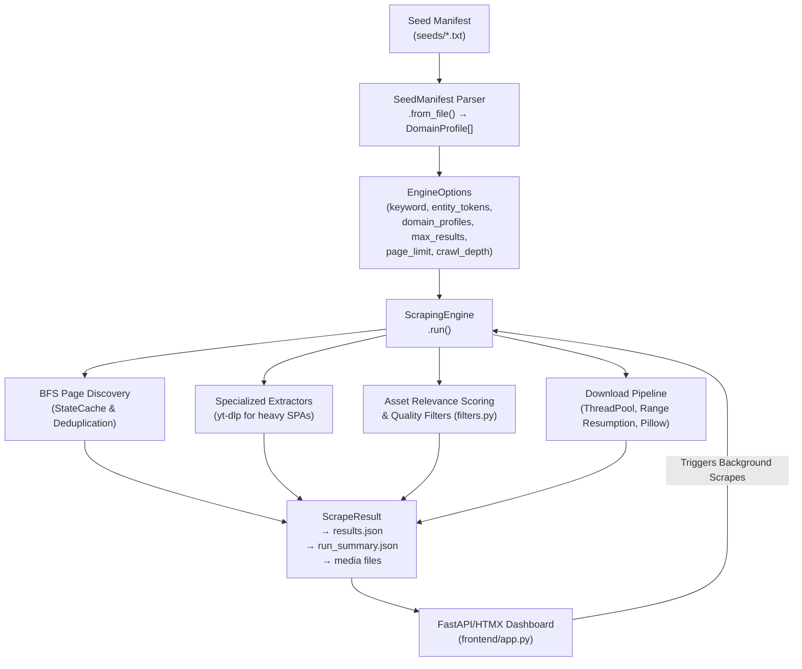
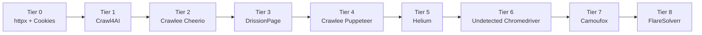
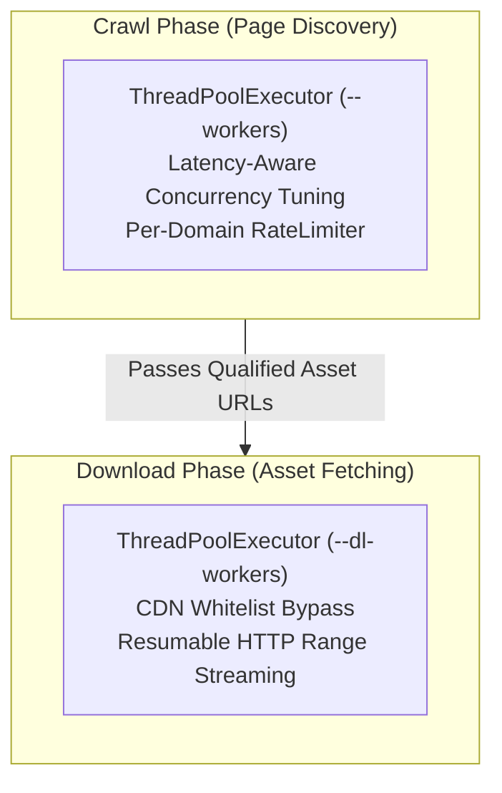

# Architecture Guide — scrAPE

> Technical reference covering system design, module organization, multi-tier fallback pipeline, concurrency model, and storage architecture.

---

## 1. System Data Flow



---

## 2. Module Layout

```text
scrape-dashboard/
├── pyproject.toml               — Standard packaging setup & `scrape` entry point
├── install.bat                  — One-click Windows installer script
├── run_frontend.bat             — WebUI launcher batch wrapper
├── requirements.txt             — Python dependencies
├── README.md                    — Primary documentation portal
│
├── crawlee_bridge/              — Node.js Express Bridge Server
│   ├── index.mjs                — Crawlee Cheerio & Puppeteer stealth servers
│   └── package.json             —got-scraping & puppeteer-extra-plugin-stealth
│
├── frontend/                    — Decoupled FastAPI + HTMX WebUI
│   ├── app.py                   — FastAPI backend, /htmx/subject-stats, telemetry, process controller
│   ├── static/                  — SVG logo, favicon, and CSS assets
│   └── templates/               — HTMX dashboard templates (index.html, gallery.html)
│
├── src/                         — Python Source Core
│   ├── cli/
│   │   ├── main.py              — Primary CLI entry point & dry-run runner
│   │   ├── launcher.py          — Interactive launcher & custom PIL RGBA 64x64 system tray renderer
│   │   ├── cli_wizard.py        — Interactive wizard for crawls, watchdog, and AI dataset formatting
│   │   ├── monitor_agent.py     — Continuous watchdog monitoring loop
│   │   └── auth.py              — Interactive headful login browser & cookie importer
│   ├── core/
│   │   ├── engine.py            — ScrapingEngine main orchestration entry point
│   │   ├── managers.py          — CrawlOrchestrator, MediaProcessor, DomainRulesManager
│   │   ├── filters.py           — Relevance scoring, low-res detection, path pre-filtering
│   │   ├── models.py            — ScrapeResult, EngineOptions, DomainProfile data models
│   │   └── seed_manifest.py     — SeedManifest parser & domain annotation builder
│   ├── scraper/
│   │   ├── google_images.py     — Search provider & fallback page scraper
│   │   └── specialized.py       — SpecializedExtractor plugin loader
│   ├── plugins/
│   │   ├── base.py              — ExtractorPlugin abstract base class
│   │   ├── reddit_extractor.py  — Reddit API extraction plugin
│   │   └── ytdlp_extractor.py   — YouTube/Generic video extraction plugin
│   ├── storage/
│   │   ├── file_downloader.py   — Resumable Range HTTP fetcher, Pillow sanitization, post-hashing
│   │   └── state_cache.py       — Persistent SQLite state cache in WAL mode
│   └── utils/
│       ├── blacklist.py         — Circuit breaker persistent domain blacklist
│       ├── crawlee_client.py    — Python client for Crawlee Express bridge
│       ├── http_client.py       — 8-tier WAF fallback pipeline, Camoufox/FlareSolverr, telemetry counters
│       ├── image_helper.py      — Fast image header parser & 64-bit dHash perceptual hashing
│       ├── robots.py            — Thread-safe RobotsChecker parser cache
│       └── session.py           — Secure session cookie store (0o600 permissions)
│
├── data/                        — JSON Configurations & Registries
│   ├── domain_config.json       — Rate limits, hotlink protection, referer overrides
│   ├── url_normalisation_rules.json — Canonicalisation regex rules
│   └── blacklist.json           — Dynamic circuit breaker blacklist
│
└── docs/                        — Technical Documentation Portal
    ├── CHANGELOG.md             — Version release history
    ├── USAGE.md                 — CLI & WebUI user manual
    ├── ARCHITECTURE.md          — Technical architecture overview
    ├── CONFIGURATION.md         — Seed annotations & settings reference
    └── QUALITY_FILTERS.md       — Scoring rules & low-res algorithms
```

---

## 3. Core Engine Components

### 3.1 ScrapingEngine & Managers (`src/core/`)

The core architecture is decoupled across specialized managers inside `src/core/managers.py`:

- **`CrawlOrchestrator`**: Manages the BFS queue, link extraction, page fetching thread pool, latency-aware dynamic concurrency adjustments, and per-domain rate limiting.
- **`MediaProcessor`**: Evaluates discovered media links against `filters.py`, performs origin URL upscaling predictions, and enqueues qualified assets for download.
- **`DomainRulesManager`**: Aggregates domain profiles parsed from `SeedManifest` with dynamic settings from `data/domain_config.json`.

### 3.2 8-Tier WAF & Challenge Escalation Pipeline (`src/utils/http_client.py`)

When encountering 403, 401, or 429 responses, `HttpClient` automatically escalates through an 8-tier fallback chain governed by a **60-second execution deadline** and host memory caching:



#### WAF Engine Overrides & Host Memory
- **Seed Manifest Annotations**: `# engine: <name>` (e.g. `# engine: camoufox`) forces a specific fallback engine to run first.
- **Host Engine Memory**: Successful solver choices are automatically cached per host (`HttpClient._preferred_engine_by_host`) and prioritized on subsequent requests.
- **Camoufox Fingerprint Tuning**: Matches host OS platform (`win`/`mac`/`lin`), enables humanized cursor/scrolling (`humanize=True`), 1920x1080 viewport, and escalates to visible headful mode for 20s if Turnstile challenge is detected on a GUI system.
- **FlareSolverr Service Integration**: Automatically forwards proxies (`self.get_proxy()`), reuses domain-keyed browser sessions (`session_domain_slug`), and performs startup health-checks. If FlareSolverr is offline, it auto-disables for the run to avoid connection timeout overhead.

#### Circuit Breakers & Fast-Fail Triggers
- **Consecutive Error Cutoff**: If a host triggers **3 consecutive request errors**, the domain is marked as failed for the run. Remaining queued items for that domain are skipped instantly with status `host_failed_skipped`.
- **Auth Wall Redirect Cutoff**: Redirects to authentication paths (`/login`, `/signin`, `/signup`, `/auth`) trigger an immediate domain cutoff.
- **Cloudflare Fast-Fail Pre-Registration**: Domains annotated with `# cloudflare: true` skip browser fallback loops instantly on 403/429.

### 3.3 Download Pipeline & Range Resumption (`src/storage/file_downloader.py`)

The download pipeline provides high-throughput, resilient asset fetching:

- **Independent Downloader Pool**: Separate thread pool (`--dl-workers`) decoupled from crawler thread limits.
- **CDN Rate-Limit Bypass**: Whitelisted CDN hosts bypass downloader rate limiting entirely; non-CDN hosts execute against a dedicated 5 req/s download limiter.
- **HTTP Range Resumption**: Checks for existing `.tmp` files. If present, requests remaining bytes using `Range: bytes=N-`:
  - **HTTP 206 Partial Content**: Appends streaming bytes (`"ab"` mode).
  - **HTTP 200 OK**: Truncates and downloads from scratch.
  - **HTTP 416 Range Not Satisfiable**: Unlinks corrupted temp chunk and retries.
- **Pillow Image Sanitization**: Intercepts image byte streams in memory, verifies image integrity, drops embedded EXIF metadata (GPS/device info), and re-encodes clean files to disk.
- **Post-Download Disk Hashing**: Calculates SHA-256 checksums directly from completed disk files, ensuring accuracy across multi-session download resumptions.

### 3.4 Persistent SQLite WAL State Cache (`src/storage/state_cache.py`)

Persistent cross-session URL caching uses SQLite configured with Write-Ahead Logging (`PRAGMA journal_mode=WAL;`). This allows concurrent multi-threaded writes without disk lock contention during massive multi-worker crawls.

---

## 4. Concurrency Architecture



- **Reentrant Locks**: Shared state updates are protected using reentrant locks (`RLock`) to prevent deadlocks across nested closures.
- **Thread-Safe Deduplication**: Global deduplication closures maintain normalized URL keys to reject duplicates before network requests are initiated.
