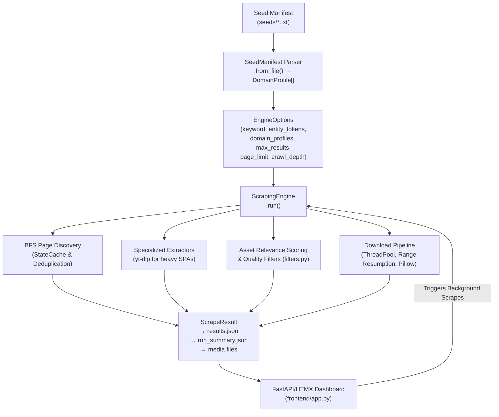
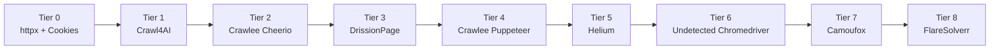

# Architecture Guide — scrAPE
> Technical reference covering system design, module organization, multi-tier fallback pipeline, concurrency model, and storage architecture.

---

## 1. System Data Flow


```mermaid
flowchart TD
    SM["Seed Manifest<br/>(seeds/*.txt)"]
    P["SeedManifest Parser<br/>.from_file() → DomainProfile[]"]
    EO["EngineOptions<br/>(keyword, entity_tokens,<br/>domain_profiles, max_results,<br/>page_limit, crawl_depth)"]
    SE["ScrapingEngine<br/>.run()"]

    BF["BFS Page Discovery<br/>(StateCache & Deduplication)"]
    SPE["Specialized Extractors<br/>(yt-dlp for heavy SPAs)"]
    AS["Asset Relevance Scoring<br/>& Quality Filters (filters.py)"]
    DLP["Download Pipeline<br/>(ThreadPool, Range Resumption, Pillow)"]

    SR["ScrapeResult<br/>→ results.json<br/>→ run_summary.json<br/>→ media files"]
    FD["FastAPI/HTMX Dashboard<br/>(frontend/app.py)"]

    SM --> P --> EO --> SE
    SE --> BF & SPE & AS & DLP
    BF --> SR
    SPE --> SR
    AS --> SR
    DLP --> SR
    SR --> FD
    FD -- Triggers Background Scrapes --> SE
```

---

## 2. Module Layout

```text
scrape-dashboard/
├── pyproject.toml               — Standard packaging setup & `scrape` entry point
├── run.bat / run.sh             — Unified Master Launcher (WebUI, Wizard, Auth, Autostart, Install)
├── run_monitor.bat / .sh        — Continuous Watchdog Agent launcher
├── docker-compose.yml           — Multi-container orchestration (Scraper + FlareSolverr)
├── requirements.txt             — Python dependencies
├── README.md                    — Primary documentation portal
│
├── crawlee_bridge/              — Node.js Express Bridge Server
│   ├── index.mjs                — Crawlee Cheerio & Puppeteer stealth servers
│   └── package.json             — got-scraping & puppeteer-extra-plugin-stealth
│
├── frontend/                    — Decoupled FastAPI + HTMX WebUI
│   ├── app.py                   — Lightweight FastAPI bootstrap, security headers, router mounting
│   ├── state.py                 — Shared state (task_state, log_buffer, process lock, broadcaster)
│   ├── static/                  — SVG logo, favicon, and CSS assets
│   ├── templates/               — HTMX dashboard templates (index.html, gallery.html)
│   └── routers/                 — Modular APIRouter packages:
│       ├── auth.py              — Basic auth & version verification
│       ├── dataset.py           — Dataset tagging, aesthetic scoring, cropping, LoRA/RAG export
│       ├── domain_config.py     — Domain configuration matrix CRUD
│       ├── gallery.py           — Media gallery browsing, pagination, deletion
│       ├── jobs.py              — Scraping execution, subprocess streaming & process controls
│       ├── notifications.py     — Notification channels and test ping endpoints
│       ├── seeds.py             — Seed Studio CRUD, validation, discovery, and linting
│       ├── settings.py          — System settings management and secret masking
│       ├── subject_profiles.py  — Subject profiles CRUD
│       ├── telemetry.py         — SSE streaming, system telemetry, engine metrics
│       ├── url_rules.py         — URL normalization rules CRUD
│       └── watchdog.py          — Continuous monitoring agent status & controls
│
├── src/                         — Python Source Core
│   ├── cli/                     — Primary CLI, interactive wizards, watchdog loop, seed studio
│   ├── config/                  — Canonical path anchoring (PROJECT_ROOT, DATA_DIR, PROFILES_DIR)
│   ├── core/                    — ScrapingEngine main orchestration, BFS crawling, parsing
│   ├── scraper/                 — Base Scraper classes, fallback logic
│   ├── plugins/                 — Platform-specific extractors (Booru, Civitai, Reddit, yt-dlp)
│   ├── captcha/                 — Universal CAPTCHA strategy providers
│   ├── ml/                      — AI tagging, cropping, LoRA exporting, Ollama vision
│   ├── monitoring/              — Hardware governor, structured telemetry
│   ├── network/                 — Tiered HTTP client, stealth pipeline, rate limiting
│   ├── notifications/           — Pluggable notification pipeline
│   └── storage/                 — SQLite WAL state caching, chunked downloading
│
├── tests/                       — Domain-Structured Automated Test Suite (458 Tests)
│   ├── conftest.py              — Global pytest fixtures, project_root resolution, network isolation
│   ├── mock_target_server.py    — Local ephemeral HTTP mock server for offline integration tests
│   ├── cli/                     — CLI launcher, wizards, preflight, release automation
│   ├── core/                    — Engine BFS, models, filters, budgets, jitter, circuit breakers
│   ├── frontend/                — WebUI endpoints, HTMX controls, SSE logs, telemetry streaming
│   ├── integration/             — E2E stealth pipelines, Seed Studio manifests, mock server flows
│   ├── ml/                      — Ollama vision, WD14 tagger, aesthetic scorer, smart cropper, RAG
│   ├── network/                 — HTTP client, TLS impersonation, proxies, CAPTCHA, browser pools
│   ├── notifications/           — Telegram bot, Discord, Slack, SMTP, Webhooks
│   ├── plugins/                 — Specialized extractors (Civitai, Booru, Instagram, Twitter, yt-dlp)
│   └── storage/                 — Downloader, chunked resumption, speed limiter, database backends
│
├── data/                        — JSON Configurations & Registries
│   ├── domain_config.json       — Rate limits, referer overrides, stealth_required, etc.
│   ├── url_normalisation_rules.json — Canonicalisation regex rules
│   └── blacklist.json           — Dynamic circuit breaker blacklist
│
├── seeds/                       — Per-subject seed manifest files (`.txt`)
└── docs/                        — Technical Documentation Portal
```

---

## 3. Core Engine Components

### 3.1 ScrapingEngine & Modular Managers (`src/core/`)

The core architecture is decoupled across specialized modules:

- **`CrawlOrchestrator`** (`src/core/orchestrator.py`): Manages the BFS queue, link extraction, page fetching thread pool, latency-aware dynamic concurrency adjustments, and per-domain rate limiting.
- **`MediaProcessor`** (`src/core/media_processor.py`): Evaluates discovered media links against `filters.py`, performs origin URL upscaling predictions, and enqueues qualified assets for download.
- **`DomainRulesManager`** (`src/core/domain_rules.py`): Aggregates domain profiles parsed from `SeedManifest` with dynamic settings from `data/domain_config.json`.

### 3.2 8-Tier WAF & Challenge Escalation Pipeline (`src/network/stealth/`)

When encountering 403, 401, or 429 responses, `HttpClient` automatically escalates through an 8-tier fallback chain governed by a **60-second execution deadline** and host memory caching.


```mermaid
flowchart LR
    T0["Tier 0<br/>httpx + Cookies"] --> T1["Tier 1<br/>Crawl4AI"]
    T1 --> T2["Tier 2<br/>Crawlee Cheerio"]
    T2 --> T3["Tier 3<br/>DrissionPage"]
    T3 --> T4["Tier 4<br/>Crawlee Puppeteer"]
    T4 --> T5["Tier 5<br/>Helium"]
    T5 --> T6["Tier 6<br/>Undetected Chromedriver"]
    T6 --> T7["Tier 7<br/>Camoufox"]
    T7 --> T8["Tier 8<br/>FlareSolverr"]
```

#### WAF Engine Overrides & Host Memory
- **Seed Manifest Annotations**: `# engine: <name>` forces a specific fallback engine to run first.
- **Host Engine Memory**: Successful solver choices are automatically cached per host and prioritized on subsequent requests.
- **Universal Captcha Strategy**: Delegates CAPTCHA solving to configured providers (`CapSolver`, `2Captcha`, `AntiCaptcha`) and caches tokens.
- **Camoufox Fingerprint Tuning**: Matches host OS platform, enables humanized cursor/scrolling, and escalates to visible headful mode for 20s if Turnstile challenge is detected on a GUI system.

#### FlareSolverr Service Integration
- Binds natively to `http://127.0.0.1:8191/v1`. Executes background Docker auto-start (`docker start flaresolverr`) if unreachable.
- Reuses domain-keyed browser sessions and enriches downstream CDN streaming media requests with session cookies.

#### Failure Models & Circuit Breakers (Fast-Fail)
To prevent infinite hanging on dead/blocked domains:
- **Consecutive Error Cutoff**: If a host triggers **3 consecutive request errors** (e.g., timeouts, strict WAF blocks), the domain is marked as failed. Remaining queued items for that domain are skipped instantly.
- **Auth Wall Redirect Cutoff**: Redirects to authentication paths (`/login`, `/signin`) trigger immediate domain cutoff.
- **Cloudflare Fast-Fail Pre-Registration**: Domains annotated with `# cloudflare: true` skip browser fallback loops instantly on 403/429.

- **Auth Wall Redirect Cutoff**: Redirects to authentication paths (`/login`, `/signin`) trigger immediate domain cutoff.
- **Cloudflare Fast-Fail Pre-Registration**: Domains annotated with `# cloudflare: true` skip browser fallback loops instantly on 403/429.

### 3.3 Dual Governor: AIMD & Hardware Load Coordination (`src/core/governor.py`, `src/monitoring/hardware_governor.py`)

The engine couples host-level network health with host-level hardware resource constraints:
- **AIMD Dynamic Concurrency Auto-Tuning**:
  - **Additive Increase**: Increases host concurrency window additively ($+1.0$) upon successful requests with healthy latency ($\le 1.5$s), scaling up to `--workers`.
  - **Multiplicative Decrease**: Throttles host window multiplicatively ($\times 0.5$) upon 429 rate limits, network errors, or severe latency spikes ($> 3.0$s), down to `min_concurrency=1`.
- **Hardware Load Governor Modulation**:
  - Real-time CPU % and available RAM % polling via `psutil`.
  - **High Load** (CPU $\ge 85.0\%$, RAM Avail $\le 15.0\%$): Throttles worker multiplier to 0.50x.
  - **Critical Load** (CPU $\ge 95.0\%$, RAM Avail $\le 5.0\%$): Throttles worker multiplier to 0.25x and triggers proactive `gc.collect()`.
- **Effective Concurrency**: Computed as `max(1, int(aimd_window * hw_scale_factor))`.

### 3.4 Ultra-Resilient Network & Stealth Core (`src/network/proxy_manager.py`, `src/network/http_client.py`)

- **Sticky TLS Impersonation Profiles**: Retains domain-consistent TLS fingerprints (`chrome120`, `chrome124`, `chrome131`, `safari17_0`, `safari18_0`, `firefox133`, `edge124`) using `curl_cffi` to bypass JA3/JA4 anomaly detection, rotating dynamically on challenge escalation.
- **Dynamic Proxy Health Scoring & Tiered Quarantine Ring**:
  - Exponential Moving Average (EMA) latency tracking ($\alpha = 0.2$).
  - Dynamic health scores $S \in [0.0, 1.0]$ factoring latency, success rate, and consecutive errors.
  - Tiered quarantine backoff with exponential penalty ($300 \times 2^{\min(4, \text{failures}-3)}$ seconds) and single-probe recovery states before reinstatement.
- **Domain Reputation Tracking**: Dynamically computes reputation $R \in [0.1, 1.0]$ to scale base request delays and rate limiter jitter.

### 3.5 Next-Gen Media Extraction Pipeline (`src/core/media_processor.py`, `src/core/microdata.py`, `src/storage/downloader/manager.py`)

- **Multi-Source Candidate Extraction**: Parses primary images alongside alternative resolutions from `srcset`, zoom attributes (`data-zoom-image`, `data-highres`, `data-original`), and parent link hrefs.
- **Schema.org JSON-LD Microdata**: Extracts structured media objects (`ImageObject`, `VideoObject`, `Product`, `Article`, `Recipe`, `@graph`) and auto-populates fallback candidate sets.
- **Automated Fallback Candidate Traversal**: When a primary candidate yields HTTP 404, 403, 410, or network failure, the downloader automatically walks candidate fallbacks without dropping the scrape record.
- **Parallel Multi-Chunk Range Downloader**: Assets exceeding 20 MB with `Accept-Ranges: bytes` support are split into concurrent byte-range worker streams and reassembled in-place.
- **Smart Pagination Detection**: Detects `<link rel="next">`, `<a rel="next">`, structured pagination elements, and query/path stepping patterns (`?page=N`, `/page/N/`).

### 3.6 High-Throughput State & Storage Core (`src/storage/bloom_filter.py`, `src/storage/state_cache.py`)

- **Zero-Dependency Bitmask Bloom Filter**: Pure Python bitmask implementation using 64-bit integer bitwise operations and Murmur-inspired multi-hash mixing for $O(1)$ in-memory L1 cache rejection before hitting SQLite disk queries.
- **Write-Staging Buffer & Batch Transactions**: URL markers are staged in memory and flushed via multi-row chunked `executemany` transactions upon reaching buffer thresholds or timeouts, reducing SQLite write lock contention.
- **Persistent SQLite WAL State Cache**: Uses `PRAGMA journal_mode=WAL;` and `PRAGMA synchronous=NORMAL;`. Auto-syncs Bloom filter state across manual purges and TTL cleanups.

### 3.7 Crawl Success Rate Auditing & Real-Time Auto-Remediation (`src/core/audit_evaluator.py`, `src/core/governor.py`, `src/core/coordinator.py`)

- **Holistic Audit Evaluation**: Computes HTTP success rate %, media download success rate %, yield efficiency (downloaded assets per second of crawl runtime), and assigns letter grades (`A+` through `F`).
- **Granular Root-Cause Breakdown**: Categorizes errors across HTTP status codes (403 WAF blocks, 429 rate limits, 5xx server errors, connection timeouts, DNS failures) with auto-tuning recommendations written directly into `run_summary.json` and printed in CLI reports.
- **Dynamic Host Health State Machine**: `CrawlGovernor` tracks a rolling window of recent host outcomes to categorize domains into states:
  - `HEALTHY` (Success Rate $\ge 80\%$)
  - `DEGRADED` (Success Rate $50\% - 79\%$)
  - `CRITICAL` (Success Rate $< 50\%$)
  - `PARKED` (Consecutive Failures $\ge 5$, 15s quiet backoff cooldown)
- **Automated Host Remediation**: When a domain transitions to `CRITICAL` or `PARKED`, the coordinator rotates its sticky TLS impersonation profile (e.g. Chrome $\to$ Safari $\to$ Firefox) and injects a 5.0s backoff penalty to prevent repetitive ban loops.

### 3.8 Resumable Crawl & State Checkpointing (`src/storage/state_cache.py`, `src/core/coordinator.py`)

- **Crash-Resilient Checkpoint Storage**: SQLite tables `crawl_checkpoints` and `crawl_queue_items` persist crawl metadata, engine options, visited URLs, and outstanding priority queue entries.
- **Transactional Snapshotting**: State is snapshotted periodically (every 30 seconds) in the background, as well as upon graceful termination or abort signal.
- **Zero-Loss Crawl Resumption**: Scrapes can be resumed cleanly using `coordinator.resume_from_checkpoint(run_id)`, restoring visited state and priority-ordered queue items without re-crawling completed pages.

### 3.9 Adaptive Priority Queue & Domain Budget Governor (`src/core/priority_queue.py`)

- **Composite Best-First URL Scoring**: Replaces raw FIFO traversal with dynamic priority queue scoring:
  - Base depth decay: deeper URLs receive negative rank adjustments ($-\text{depth} \times 10.0$).
  - Historical domain yield density boost: $+15.0 \times \text{yield\_density}$.
  - Token/keyword matching: $+5.0$ bonus per matched query token in path and query string.
- **Domain Budget Governor**:
  - Enforces per-domain budget ceilings.
  - Soft threshold ($\ge 80\%$ of budget): applies a $-50.0$ score penalty to prioritize unbudgeted domains.
  - Hard threshold ($100\%$ of budget): rejects new link enqueueing from that domain entirely.

### 3.10 Zero-Copy Streaming Ingest & Inline Hashing (`src/storage/downloader/manager.py`)

- **Single-Pass Socket-to-Disk Streaming**: Computes SHA-256 digests in-memory via `hashlib.sha256()` as raw chunks stream from the network socket to disk.
- **Inline Magic-Byte Sniffing**: Inspects the first 1,024 bytes of the in-flight stream to verify true MIME signatures (JPEG, PNG, WebP, GIF, MP4, WebM) without re-opening files.
- **Disk Re-Read Elimination**: Completely removes secondary disk read passes for non-image assets and verified streams. For resumed downloads (`HTTP 206`), existing bytes are hashed once upon init and chained into the stream.

### 3.11 Sticky Per-Domain Hardware Stealth Fingerprinting (`src/network/stealth_fingerprint.py`, `src/network/browser_client.py`)

- **Deterministic Hash-Seeded Hardware Profiles**: Maps each domain deterministically to an authentic GPU hardware profile (NVIDIA RTX 3080/4070, AMD Radeon RX 6700 XT, Intel Iris Xe, Apple M2 Pro/M1 Max).
- **Multi-Vector Fingerprint Defense**:
  - **WebGL / WebGL2**: Spoofs unmasked vendor and renderer strings alongside shader language version.
  - **Canvas 2D**: Subtle, deterministic sub-perceptual RGB noise injection ($\pm 1$ LSB jitter) thwarting canvas fingerprint clustering.
  - **AudioContext**: Micro-frequency perturbation and latency jitter on `AnalyserNode` and `AudioBuffer`.
  - **WebRTC**: Filters private and host candidates from SDP offers to eliminate local and VPN-bypass IP leakage.
  - **Navigator**: Synchronizes `hardwareConcurrency`, `deviceMemory`, and masks `navigator.webdriver`.
- **Pre-Execution Browser Injection**: Injects stealth scripts via CDP `Page.addScriptToEvaluateOnNewDocument` across all fallback browser automation engines (DrissionPage, Crawl4AI, Nodriver, Camoufox, Helium, UC) before page scripts execute.

### 3.12 Asynchronous Inline ML Pipeline Stage (`src/core/ml_worker.py`)

- **Decoupled Architecture**: Removes heavy CPU/GPU machine learning tasks from the live crawl network thread. Crawl workers enqueue downloaded items into a thread-safe `queue.Queue`.
- **Inline Background Processing**: `AsyncMLPipelineWorker` processes items asynchronously in background threads:
  - **Aesthetic Quality Scoring**: Evaluates visual quality and rejects low-score/watermarked images below `--aesthetic-score` threshold.
  - **Smart Cropping**: Executes face- and body-centered smart cropping (`DatasetCropper`) when `--auto-crop` is passed.
  - **WD14 Dataset Tagging**: Generates Booru tags and caption sidecar `.txt` files (`DatasetTagger`) when `--tag-dataset` is passed.
- **Post-Crawl Exporters**: Automatically invokes `RagExporter` (chunked RAG vector payloads) and `DatabaseExporter` (SQLite relational export) at crawl completion.

### 3.13 Multi-Tier Storage Sinks & Hierarchical Deduplication (`src/storage/`)

- **Pluggable Storage Sinks (`src/storage/storage_backend.py`)**:
  - `BaseStorageSink` protocol defining `store()`, `exists()`, `get_uri()`, and `delete()`.
  - `LocalStorageSink`: Implements atomic `.tmp_xxx` staging, strict directory traversal prevention, and POSIX path sanitization.
  - `S3StorageSink`: Streams media directly to Amazon S3 or MinIO via `boto3` multipart uploads with automatic local spillover fallback when offline or unauthenticated.
- **3-Tier Deduplication Cascade (`src/storage/hierarchical_dedup.py`)**:
  - **Tier 1 (L1) SHA-256 Bloom Filter**: Memory-efficient byte deduplication rejecting exact binary matches in $O(1)$.
  - **Tier 2 (L2) BK-Tree pHash Index**: 64-bit DCT perceptual hash stored in a Discrete Metric Tree (BK-Tree) querying near-duplicates within Hamming distance $\le 4$.
  - **Tier 3 (L3) Vector Cosine Similarity Index**: Cosine similarity ($\ge 0.96$) for semantic visual embeddings.

### 3.14 Autonomous Self-Healing DOM Parser (`src/core/self_healing_parser.py`)

- **Multi-Tier Cascade**:
  - **Tier 1 (SQLite Rule Cache)**: Stores and retrieves verified selector repairs from `repaired_selectors` table in `results.db`.
  - **Tier 2 (Structural Tree Heuristics & Microdata)**: Evaluates semantic HTML tags (`figure`, `article`, `main`), JSON-LD schema metadata (`ImageObject`, `VideoObject`), OpenGraph tags (`og:image`, `og:video`), and microdata attributes.
  - **Tier 3 (Pluggable LLM Synthesizer)**: LLM selector synthesis with SQLite caching for high-entropy dynamic websites.
- **Semantic Selector Integration (`src/core/semantic_selectors.py`)**:
  - Hooked directly into `SemanticSelectorParser.extract()`. Automatically executes self-healing cascade when primary selectors return 0 results.

### 3.15 Hybrid Concurrency Worker Pool & Process Lifecycle (`src/core/worker_pool.py`)

- **Dual Concurrency Pool**:
  - `HybridWorkerPool` providing CPU/GPU process isolation via `ProcessPoolExecutor` with Python `spawn` context and automatic thread fallback for lightweight systems.
  - Active worker tracking, memory consumption checks, and automatic task cancellation.
  - Comprehensive recursive child process discovery and termination via `psutil` process trees, ensuring zero zombie child processes.
  - Emergency `atexit` supervisor hook guaranteeing clean shutdown on unexpected process exits.

### 3.16 Pre-Warmed Browser Lifecycle Pool (`src/network/prewarmed_browser_pool.py`)

- **Sub-50ms Cold-Start Latency**: Pre-initializes browser sessions (DrissionPage, Camoufox, Chromium) in a background maintenance loop so crawling tasks obtain live browser contexts instantly.
- **Resource Lifecycle**: Tracks per-instance operation counts, recycling instances after 20 operations to eliminate memory bloat, and evicts idle instances exceeding 300s TTL.
- **Process Cleanup**: Explicitly terminates all child processes upon pool shutdown using `psutil`.

### 3.17 Distributed Redis Streams Task Broker (`src/core/worker_pool.py`)

- **Enterprise Queue Federation**: Implements `RedisStreamTaskBroker` utilizing Redis Streams (`XADD`, `XREADGROUP`, `XACK`, `XPENDING`, `XCLAIM`) with distributed consumer groups for multi-node scraper clusters.
- **Orphan Task Auto-Claiming**: Detects stalled or crashed workers via pending entry idle thresholds, claiming and reassigning unacknowledged tasks.
- **Zero-Dependency Fallback**: Degrades transparently to `InMemoryTaskBroker` when Redis is unavailable or unconfigured.

### 3.18 Hardware Device Manager & Multi-Provider LLM Gateway (`src/ml/hardware.py`, `src/core/self_healing_parser.py`)

- **Dynamic Device & Precision Selection**: Detects NVIDIA CUDA, DirectML (`torch_directml` / `PrivateUseOne` on Windows), Apple Silicon MPS, or multi-threaded CPU, automatically applying FP16 or FP32 precision.
- **Multi-Provider LLM Healing**: Pluggable LLM fallback for `SelfHealingDOMParser` supporting local Ollama (`qwen2.5-coder`), Google Gemini 1.5 Flash, and OpenAI GPT-4o-mini with SQLite repair caching.

### 3.19 Content-Addressable Storage (CAS) (`src/storage/cas_store.py`)

- **Zero-Byte Duplicate Storage**: Hashes media files with SHA-256 and organizes content into two-character hex prefix shards (`cas/ab/cdef...`).
- **Atomic Hardlinks**: Uses NTFS/POSIX hardlinks (`os.link`) to link files into per-run keyword directories without consuming additional disk space. Falls back to cross-volume copying when hardlinks fail.

### 3.20 Columnar Apache Parquet Dataset Exporter (`src/storage/parquet_exporter.py`)

- **High-Performance Analytics Schema**: Compiles crawl results into structured PyArrow tables (`images.parquet`, `videos.parquet`, `run_summary.parquet`) with Snappy compression for high-performance ML ingestion and duckdb/Pandas querying.
- **Resilient Fallback**: Automatically emits `.jsonl` records if PyArrow is not installed.


---

## 4. Security & Static Analysis (CodeQL & Semgrep)

The project employs strict structural mitigations against vulnerabilities like Path Injection (`py/path-injection`), avoiding manual `# codeql` suppressions:
1. **Untainted Root Generation**: Dynamically rebuilds the base drive (`os.path.splitdrive`).
2. **Absolute Normalization**: Forces input paths through `os.path.abspath(os.path.normpath())`.
3. **Prefix Boundary Enforcement**: Checks bounds via `.startswith(safe_root)`.

---

## 5. Docker Architecture

When deploying in containerized environments:
- Enforces `PUPPETEER_SKIP_DOWNLOAD=true` to prevent redundant Chromium downloads during build.
- Configures `PUPPETEER_EXECUTABLE_PATH=/usr/bin/chromium` to bind system Chromium directly to Node.js Crawlee operations without browser version conflicts.
- Runs under non-root `USER appuser` with permissions pre-configured for `data`, `seeds`, `logs`, and `output`.
