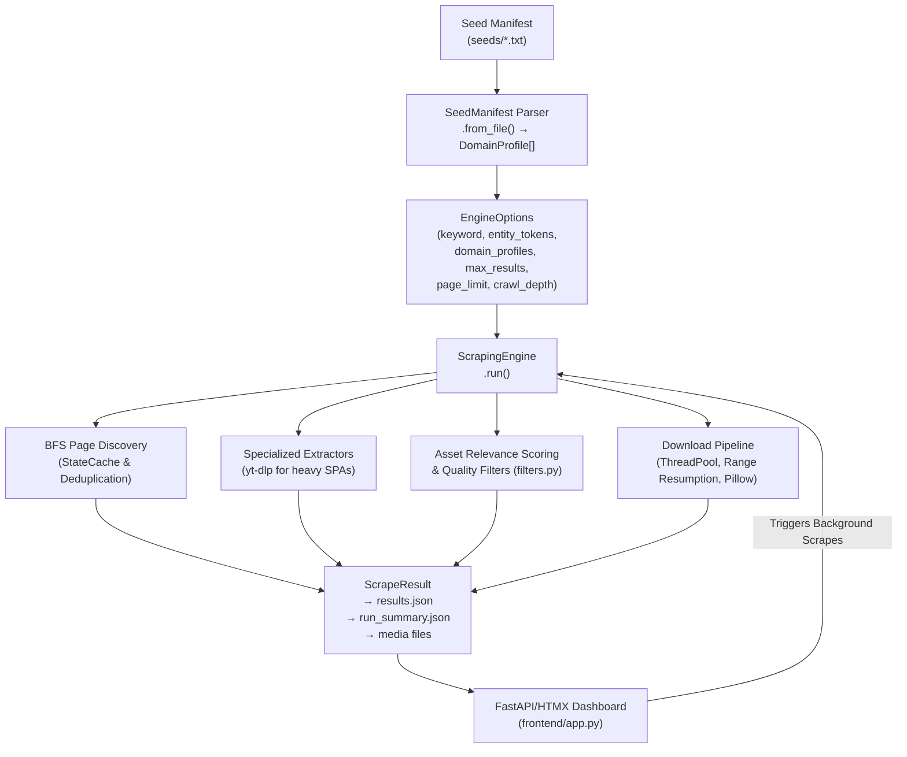
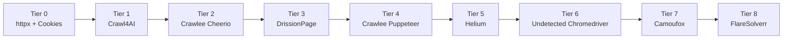
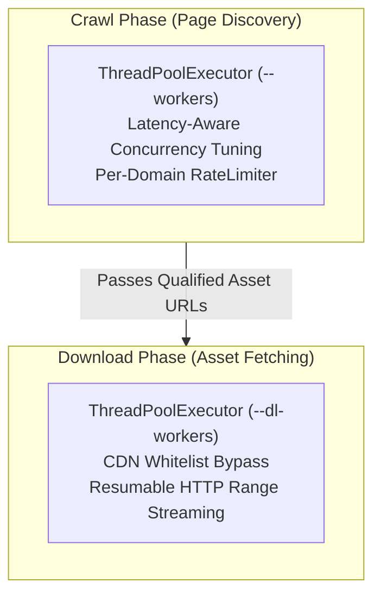

# Architecture Guide — scrAPE

> Technical reference covering system design, module organization, multi-tier fallback pipeline, concurrency model, and storage architecture.

---

## 1. System Data Flow


```mermaid
flowchart TD
    SM["Seed Manifest<br/>(seeds/*.txt)"]
    P["SeedManifest Parser<br/>.from_file() → DomainProfile[]"]
    EO["EngineOptions<br/>(keyword, entity_tokens,<br/>domain_profiles, max_results,<br/>page_limit, crawl_depth)"]
    SE["ScrapingEngine<br/>.run()"]

    BF["BFS Page Discovery<br/>(StateCache & Deduplication)"]
    SPE["Specialized Extractors<br/>(yt-dlp for heavy SPAs)"]
    AS["Asset Relevance Scoring<br/>& Quality Filters (filters.py)"]
    DLP["Download Pipeline<br/>(ThreadPool, Range Resumption, Pillow)"]

    SR["ScrapeResult<br/>→ results.json<br/>→ run_summary.json<br/>→ media files"]
    FD["FastAPI/HTMX Dashboard<br/>(frontend/app.py)"]

    SM --> P --> EO --> SE
    SE --> BF & SPE & AS & DLP
    BF --> SR
    SPE --> SR
    AS --> SR
    DLP --> SR
    SR --> FD
    FD -- Triggers Background Scrapes --> SE
```

---

## 2. Module Layout

```text
scrape-dashboard/
├── pyproject.toml               — Standard packaging setup & `scrape` entry point
├── run.bat / run.sh             — Unified Master Launcher (WebUI, Wizard, Auth, Autostart, Install)
├── run_monitor.bat / .sh        — Continuous Watchdog Agent launcher
├── docker-compose.yml           — Multi-container orchestration (Scraper + FlareSolverr)
├── Dockerfile                   — Container build instructions
├── requirements.txt             — Python dependencies
├── README.md                    — Primary documentation portal
│
├── crawlee_bridge/              — Node.js Express Bridge Server
│   ├── index.mjs                — Crawlee Cheerio & Puppeteer stealth servers
│   └── package.json             —got-scraping & puppeteer-extra-plugin-stealth
│
├── frontend/                    — Decoupled FastAPI + HTMX WebUI
│   ├── app.py                   — FastAPI backend, /htmx/subject-stats, telemetry, process controller
│   ├── static/                  — SVG logo, favicon, and CSS assets
│   └── templates/               — HTMX dashboard templates (index.html, gallery.html)
│
├── src/                         — Python Source Core
│   ├── cli/
│   │   ├── main.py              — Primary CLI entry point & dry-run runner
│   │   ├── launcher.py          — Interactive launcher & custom PIL RGBA 64x64 system tray renderer
│   │   ├── cli_wizard.py        — Interactive wizard for crawls, watchdog, and AI dataset formatting
│   │   ├── monitor_agent.py     — Continuous watchdog monitoring loop
│   │   ├── auth.py              — Interactive headful login browser & cookie importer
│   │   ├── cleanup.py           — Output and cache cleanup utilities
│   │   ├── release.py           — Automated release packaging script
│   │   └── seed_studio.py       — AI-assisted seed generation and discovery
│   ├── core/
│   │   ├── engine.py            — ScrapingEngine main orchestration entry point
│   │   ├── managers.py          — CrawlOrchestrator, MediaProcessor, DomainRulesManager
│   │   ├── filters.py           — Relevance scoring, low-res detection, path pre-filtering
│   │   ├── models.py            — ScrapeResult, EngineOptions, DomainProfile data models
│   │   ├── seed_manifest.py     — SeedManifest parser & domain annotation builder
│   │   ├── coordinator.py       — Cross-manager state synchronization
│   │   ├── governor.py          — Concurrency governor base classes
│   │   ├── parser.py            — HTML structure and link extraction
│   │   ├── pipeline.py          — Extractor processing pipeline
│   │   ├── run_summary.py       — Run outcome report generation
│   │   └── semantic_selectors.py — CSS selector heuristics
│   ├── scraper/
│   │   ├── base.py              — Base Scraper classes
│   │   ├── google_images.py     — Search provider & fallback page scraper
│   │   ├── specialized.py       — SpecializedExtractor plugin loader
│   │   └── video_scraper.py     — Video extraction: JSON-LD, inline scripts, lightbox anchors, nested <video>, base64 iframes
│   ├── plugins/
│   │   ├── base.py                     — ExtractorPlugin abstract base class
│   │   ├── base64_iframe_extractor.py   — Extracts video URLs from base64-encoded iframe player params
│   │   ├── booru_extractor.py           — Danbooru/Gelbooru image board extractor
│   │   ├── civitai_extractor.py         — Civitai model/asset gallery extractor
│   │   ├── reddit_extractor.py          — Reddit API extraction plugin
│   │   ├── ytdlp_extractor.py           — YouTube/Generic video extraction via yt-dlp
│   │   └── *_extractor.py               — Platform extractors: Twitter, Instagram, Pinterest, ArtStation, Telegram
│   ├── captcha/
│   │   ├── captcha_strategy.py  — Third-party captcha solving strategy and orchestrator
│   │   └── captcha_solvers/     — Universal captcha providers (CapSolver, 2Captcha, AntiCaptcha)
│   ├── common/
│   │   ├── blacklist.py         — Circuit breaker persistent domain blacklist
│   │   ├── image_helper.py      — Fast image header parser & 64-bit dHash perceptual hashing
│   │   └── robots.py            — Thread-safe RobotsChecker parser cache
│   ├── ml/
│   │   ├── aesthetic_scorer.py  — Opt-in aesthetic quality scorer
│   │   ├── dataset_tagger.py    — AI dataset auto-tagging
│   │   ├── dataset_cropper.py   — AI dataset smart cropping
│   │   ├── dataset_exporter.py  — Kohya_ss LoRA dataset ZIP exporter
│   │   └── vector_phash.py      — Vectorized perceptual hashing utilities
│   ├── monitoring/
│   │   ├── hardware_governor.py — Dynamic memory and CPU monitoring for concurrency scaling
│   │   ├── logger.py            — Telemetry and structured logging
│   │   └── telemetry.py         — Application telemetry collection
│   ├── network/
│   │   ├── http_client.py       — 8-tier WAF fallback pipeline, Camoufox/FlareSolverr, telemetry counters
│   │   ├── stealth_pipeline.py  — Orchestrates 8-tier WAF bypass with HardwareLoadGovernor concurrency
│   │   ├── session.py           — Secure session cookie store (0o600 permissions)
│   │   ├── session_pool.py      — Per-domain sticky sessions with disk persistence
│   │   ├── proxy_manager.py     — Proxy pool manager with latency auto-quarantine & domain binding
│   │   ├── proxy_fetcher.py     — Automated free proxy fetcher and validator
│   │   ├── crawlee_client.py    — Python client for Crawlee Express bridge
│   │   ├── flaresolverr_monitor.py — FlareSolverr lifecycle manager
│   │   ├── rate_limiter.py      — Token-bucket request rate limiting
│   │   ├── bandwidth_limiter.py — Asset download bandwidth limiting
│   │   └── browser_pool.py      — Headless browser instance pooling
│   ├── notifications/
│   │   ├── telegram_bot.py      — Telegram Bot alerts & interactive command handler
│   │   └── notification_manager.py — Pluggable multi-channel notification pipeline
│   └── storage/
│       ├── file_downloader.py   — Resumable Range HTTP fetcher, Pillow sanitization, post-hashing
│       ├── state_cache.py       — Persistent SQLite state cache in WAL mode
│       ├── checkpoint_db.py     — Persistent crawling checkpoints
│       ├── db_store.py          — General SQLite data store wrappers
│       ├── csv_writer.py        — Flat CSV exporter
│       ├── json_writer.py       — JSON object lines exporter
│       ├── rag_exporter.py      — Markdown/JSONL RAG ingestion formats
│       ├── dataset_exporter.py  — Structured dataset exporter
│       └── database_exporter.py — SQLite database bulk exporter
│
├── data/                        — JSON Configurations & Registries
│   ├── domain_config.json       — Rate limits, hotlink protection, referer overrides, domain_handlers,
│   │                              stealth_required, preferred_engines, highres_transforms, auth_gated
│   ├── url_normalisation_rules.json — Canonicalisation regex rules
│   └── blacklist.json           — Dynamic circuit breaker blacklist
│   ├── seeds/                       — Per-subject seed manifest files
│   │   ├── subject1.txt / subject2.txt / subject3.txt — Creator-specific domain profiles
│   │   ├── subject4.txt / subject5.txt              — Creator-specific domain profiles
│   │   └── general_topic1.txt / general_topic2.txt  — General-subject example seeds
│
└── docs/                        — Technical Documentation Portal
    ├── CHANGELOG.md             — Version release history
    ├── USAGE.md                 — CLI & WebUI user manual
    ├── ARCHITECTURE.md          — Technical architecture overview
    ├── CONFIGURATION.md         — Seed annotations & settings reference
    ├── QUALITY_FILTERS.md       — Scoring rules & low-res algorithms
    └── SECURITY.md              — Security policies and static analysis compliance
```

---

## 3. Core Engine Components

### 3.1 ScrapingEngine & Managers (`src/core/`)

The core architecture is decoupled across specialized managers inside `src/core/managers.py`:

- **`CrawlOrchestrator`**: Manages the BFS queue, link extraction, page fetching thread pool, latency-aware dynamic concurrency adjustments, and per-domain rate limiting.
- **`MediaProcessor`**: Evaluates discovered media links against `filters.py`, performs origin URL upscaling predictions, and enqueues qualified assets for download.
- **`DomainRulesManager`**: Aggregates domain profiles parsed from `SeedManifest` with dynamic settings from `data/domain_config.json`.

### 3.2 8-Tier WAF & Challenge Escalation Pipeline (`src/network/http_client.py` & `src/network/stealth_pipeline.py`)

When encountering 403, 401, or 429 responses, `HttpClient` automatically escalates through an 8-tier fallback chain governed by a **60-second execution deadline** and host memory caching.
The `StealthPipeline` uses a `HardwareLoadGovernor` to dynamically adjust worker concurrency (1x to 3x scaling) based on real-time system RAM and CPU telemetry, automatically forcing garbage collection when approaching OOM limits:


```mermaid
flowchart LR
    T0["Tier 0<br/>httpx + Cookies"] --> T1["Tier 1<br/>Crawl4AI"]
    T1 --> T2["Tier 2<br/>Crawlee Cheerio"]
    T2 --> T3["Tier 3<br/>DrissionPage"]
    T3 --> T4["Tier 4<br/>Crawlee Puppeteer"]
    T4 --> T5["Tier 5<br/>Helium"]
    T5 --> T6["Tier 6<br/>Undetected Chromedriver"]
    T6 --> T7["Tier 7<br/>Camoufox"]
    T7 --> T8["Tier 8<br/>FlareSolverr"]
```

#### WAF Engine Overrides & Host Memory
- **Seed Manifest Annotations**: `# engine: <name>` (e.g. `# engine: camoufox`) forces a specific fallback engine to run first.
- **Host Engine Memory**: Successful solver choices are automatically cached per host (`HttpClient._preferred_engine_by_host`) and prioritized on subsequent requests.
- **Universal Captcha Strategy**: During challenge loops, the `ThirdPartyCaptchaStrategy` automatically delegates CAPTCHA solving (Turnstile, reCAPTCHA, hCaptcha) to configured providers (`CapSolver`, `2Captcha`, `AntiCaptcha`) and caches the tokens.
- **Camoufox Fingerprint Tuning**: Matches host OS platform (`win`/`mac`/`lin`), enables humanized cursor/scrolling (`humanize=True`), 1920x1080 viewport, and escalates to visible headful mode for 20s if Turnstile challenge is detected on a GUI system.
#### FlareSolverr Service Integration & Daemon Stability
- **Binding & Session Reuse**: Binds natively to `http://127.0.0.1:8191/v1` with dual-stack fallback (`localhost:8191`). If port 8191 is unreachable, executes background Docker auto-start (`docker start flaresolverr`) and waits 3.5s before re-pinging. Automatically forwards proxies (`self.get_proxy()`), reuses domain-keyed browser sessions (`session_domain_slug`), and enriches downstream CDN streaming media requests with session cookies. If FlareSolverr is offline, auto-disables for the run to avoid connection timeout overhead.
- **Graceful Thread Shutdown**: The background `FlareSolverrMonitor` daemon thread ensures a clean tear-down during Python interpreter shutdown (e.g. at the end of pytest suites). It uses interruptible 1-second sleep loops and explicitly traps `ValueError: I/O operation on closed file` when the main thread closes logging streams, preventing noisy stack traces and zombie threads.

#### Circuit Breakers & Fast-Fail Triggers
- **Consecutive Error Cutoff**: If a host triggers **3 consecutive request errors**, the domain is marked as failed for the run. Remaining queued items for that domain are skipped instantly with status `host_failed_skipped`.
- **Auth Wall Redirect Cutoff**: Redirects to authentication paths (`/login`, `/signin`, `/signup`, `/auth`) trigger an immediate domain cutoff.
- **Cloudflare Fast-Fail Pre-Registration**: Domains annotated with `# cloudflare: true` skip browser fallback loops instantly on 403/429.

### 3.3 Download Pipeline, Speed Limiters & Range Resumption (`src/storage/file_downloader.py`)

The download pipeline provides high-throughput, resilient asset fetching with bandwidth throttling:

- **Independent Downloader Pool**: Separate thread pool (`--dl-workers`) decoupled from crawler thread limits.
- **Dual Token-Bucket Speed Limiters**:
  - **Page Rate Limiter (`--rate-limit` / `RPS`)**: Regulates outgoing page requests per second.
  - **Download Speed Limiter (`--dl-speed-limit` / `KBPS`)**: Throttles network throughput across active asset download streams.
- **Per-Host Download Semaphore (`_host_semaphore_for`)**: Wraps active HTTP streaming requests to enforce host-level concurrency caps during download transfers.
- **CDN Rate-Limit Bypass**: Whitelisted CDN hosts bypass downloader rate limiting entirely; non-CDN hosts execute against a dedicated download limiter.
- **HTTP Range Resumption**: Checks for existing `.tmp` files. If present, requests remaining bytes using `Range: bytes=N-`:
  - **HTTP 206 Partial Content**: Appends streaming bytes (`"ab"` mode).
  - **HTTP 200 OK**: Truncates and downloads from scratch.
  - **HTTP 416 Range Not Satisfiable**: Unlinks corrupted temp chunk and retries.
- **Pillow Image Sanitization**: Intercepts image byte streams in memory, verifies image integrity, drops embedded EXIF metadata (GPS/device info), and re-encodes clean files to disk.
- **Post-Download Disk Hashing**: Calculates SHA-256 checksums directly from completed disk files, ensuring accuracy across multi-session download resumptions.

### 3.4 Persistent SQLite WAL State Cache (`src/storage/state_cache.py`)

Persistent cross-session URL caching uses SQLite configured with Write-Ahead Logging (`PRAGMA journal_mode=WAL;`). This allows concurrent multi-threaded writes without disk lock contention during massive multi-worker crawls.

### 3.5 Security & Static Analysis (CodeQL & Semgrep)

To natively pass enterprise CodeQL and Semgrep static analysis without relying on manual suppression flags (`# codeql`, `// nosemgrep`), the project employs strict structural mitigations against vulnerabilities like Path Injection (`py/path-injection`):
- **Untainted Root Generation**: Arbitrary path resolutions dynamically rebuild their base drive or root prefix (`os.path.splitdrive(abs_path)[0]` on Windows, `os.sep` on POSIX) directly from the OS, guaranteeing the base prefix is untainted by user input.
- **Absolute Normalization**: Input paths are forced through `os.path.abspath(os.path.normpath(user_input))` to prevent `../` directory traversal.
- **Prefix Boundary Enforcement**: The normalized absolute path is strictly checked against the untainted root via `.startswith(safe_root)`, satisfying static analyzers' requirement for mathematical proof of bounds checking before filesystem sink access.

### 3.6 Docker Architecture & Dependency Isolation

When deploying scrAPE in containerized environments, the architecture explicitly separates Playwright's browser management from the Node.js `crawlee_bridge`:
- **`PUPPETEER_SKIP_DOWNLOAD=true`**: Because the `crawlee_bridge` relies on `puppeteer-extra-plugin-stealth`, a standard `npm install` attempts to download its own Chromium binaries. By enforcing `PUPPETEER_SKIP_DOWNLOAD=true` at the environment level, we prevent redundant browser downloads and ensure Puppeteer seamlessly hooks into the managed, centrally patched Playwright Chromium binary already provided by the base image.
- **Base Image Symlinking**: The Dockerfile orchestrates symlinks between Playwright's Chromium executable and the paths expected by the Node.js bridge to guarantee stealth features operate without conflicts.

---

## 4. Concurrency Architecture


```mermaid
flowchart TD
    subgraph CrawlPhase["Crawl Phase (Page Discovery)"]
        PP["ThreadPoolExecutor (--workers)<br/>Latency-Aware Concurrency Tuning<br/>Per-Domain RateLimiter"]
    end

    subgraph DownloadPhase["Download Phase (Asset Fetching)"]
        DP["ThreadPoolExecutor (--dl-workers)<br/>CDN Whitelist Bypass<br/>Resumable HTTP Range Streaming"]
    end

    CrawlPhase -- Passes Qualified Asset URLs --> DownloadPhase
```

- **Reentrant Locks**: Shared state updates are protected using reentrant locks (`RLock`) to prevent deadlocks across nested closures.
- **Thread-Safe Deduplication**: Global deduplication closures maintain normalized URL keys to reject duplicates before network requests are initiated.
