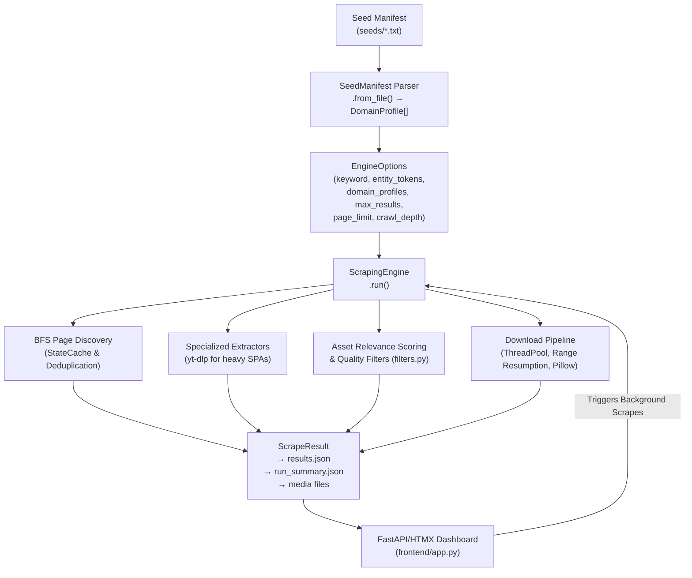
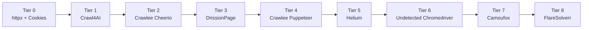

# Architecture Guide — scrAPE
> Technical reference covering system design, module organization, multi-tier fallback pipeline, concurrency model, and storage architecture.

---

## 1. System Data Flow


```mermaid
flowchart TD
    SM["Seed Manifest<br/>(seeds/*.txt)"]
    P["SeedManifest Parser<br/>.from_file() → DomainProfile[]"]
    EO["EngineOptions<br/>(keyword, entity_tokens,<br/>domain_profiles, max_results,<br/>page_limit, crawl_depth)"]
    SE["ScrapingEngine<br/>.run()"]

    BF["BFS Page Discovery<br/>(StateCache & Deduplication)"]
    SPE["Specialized Extractors<br/>(yt-dlp for heavy SPAs)"]
    AS["Asset Relevance Scoring<br/>& Quality Filters (filters.py)"]
    DLP["Download Pipeline<br/>(ThreadPool, Range Resumption, Pillow)"]

    SR["ScrapeResult<br/>→ results.json<br/>→ run_summary.json<br/>→ media files"]
    FD["FastAPI/HTMX Dashboard<br/>(frontend/app.py)"]

    SM --> P --> EO --> SE
    SE --> BF & SPE & AS & DLP
    BF --> SR
    SPE --> SR
    AS --> SR
    DLP --> SR
    SR --> FD
    FD -- Triggers Background Scrapes --> SE
```

---

## 2. Module Layout

```text
scrape-dashboard/
├── pyproject.toml               — Standard packaging setup & `scrape` entry point
├── run.bat / run.sh             — Unified Master Launcher (WebUI, Wizard, Auth, Autostart, Install)
├── run_monitor.bat / .sh        — Continuous Watchdog Agent launcher
├── docker-compose.yml           — Multi-container orchestration (Scraper + FlareSolverr)
├── requirements.txt             — Python dependencies
├── README.md                    — Primary documentation portal
│
├── crawlee_bridge/              — Node.js Express Bridge Server
│   ├── index.mjs                — Crawlee Cheerio & Puppeteer stealth servers
│   └── package.json             — got-scraping & puppeteer-extra-plugin-stealth
│
├── frontend/                    — Decoupled FastAPI + HTMX WebUI
│   ├── app.py                   — FastAPI backend, OWASP security middleware, static mounts
│   ├── static/                  — SVG logo, favicon, and CSS assets
│   ├── templates/               — HTMX dashboard templates (index.html, gallery.html)
│   └── routers/                 — Decoupled APIRouter sub-modules (dashboard, dataset, seeds, watchdog, notifications)
│
├── src/                         — Python Source Core
│   ├── cli/                     — Primary CLI, interactive wizards, watchdog loop, seed studio
│   ├── core/                    — ScrapingEngine main orchestration, BFS crawling, parsing
│   ├── scraper/                 — Base Scraper classes, fallback logic
│   ├── plugins/                 — Platform-specific extractors (Booru, Civitai, Reddit, yt-dlp)
│   ├── captcha/                 — Universal CAPTCHA strategy providers
│   ├── ml/                      — AI tagging, cropping, LoRA exporting, Ollama vision
│   ├── monitoring/              — Hardware governor, structured telemetry
│   ├── network/                 — Tiered HTTP client, stealth pipeline, rate limiting
│   ├── notifications/           — Pluggable notification pipeline
│   └── storage/                 — SQLite WAL state caching, chunked downloading
│
├── data/                        — JSON Configurations & Registries
│   ├── domain_config.json       — Rate limits, referer overrides, stealth_required, etc.
│   ├── url_normalisation_rules.json — Canonicalisation regex rules
│   └── blacklist.json           — Dynamic circuit breaker blacklist
│
├── seeds/                       — Per-subject seed manifest files (`.txt`)
└── docs/                        — Technical Documentation Portal
```

---

## 3. Core Engine Components

### 3.1 ScrapingEngine & Managers (`src/core/`)

The core architecture is decoupled across specialized managers inside `src/core/managers.py`:

- **`CrawlOrchestrator`**: Manages the BFS queue, link extraction, page fetching thread pool, latency-aware dynamic concurrency adjustments, and per-domain rate limiting.
- **`MediaProcessor`**: Evaluates discovered media links against `filters.py`, performs origin URL upscaling predictions, and enqueues qualified assets for download.
- **`DomainRulesManager`**: Aggregates domain profiles parsed from `SeedManifest` with dynamic settings from `data/domain_config.json`.

### 3.2 8-Tier WAF & Challenge Escalation Pipeline

When encountering 403, 401, or 429 responses, `HttpClient` automatically escalates through an 8-tier fallback chain governed by a **60-second execution deadline** and host memory caching.


```mermaid
flowchart LR
    T0["Tier 0<br/>httpx + Cookies"] --> T1["Tier 1<br/>Crawl4AI"]
    T1 --> T2["Tier 2<br/>Crawlee Cheerio"]
    T2 --> T3["Tier 3<br/>DrissionPage"]
    T3 --> T4["Tier 4<br/>Crawlee Puppeteer"]
    T4 --> T5["Tier 5<br/>Helium"]
    T5 --> T6["Tier 6<br/>Undetected Chromedriver"]
    T6 --> T7["Tier 7<br/>Camoufox"]
    T7 --> T8["Tier 8<br/>FlareSolverr"]
```

#### WAF Engine Overrides & Host Memory
- **Seed Manifest Annotations**: `# engine: <name>` forces a specific fallback engine to run first.
- **Host Engine Memory**: Successful solver choices are automatically cached per host and prioritized on subsequent requests.
- **Universal Captcha Strategy**: Delegates CAPTCHA solving to configured providers (`CapSolver`, `2Captcha`, `AntiCaptcha`) and caches tokens.
- **Camoufox Fingerprint Tuning**: Matches host OS platform, enables humanized cursor/scrolling, and escalates to visible headful mode for 20s if Turnstile challenge is detected on a GUI system.

#### FlareSolverr Service Integration
- Binds natively to `http://127.0.0.1:8191/v1`. Executes background Docker auto-start (`docker start flaresolverr`) if unreachable.
- Reuses domain-keyed browser sessions and enriches downstream CDN streaming media requests with session cookies.

#### Failure Models & Circuit Breakers (Fast-Fail)
To prevent infinite hanging on dead/blocked domains:
- **Consecutive Error Cutoff**: If a host triggers **3 consecutive request errors** (e.g., timeouts, strict WAF blocks), the domain is marked as failed. Remaining queued items for that domain are skipped instantly.
- **Auth Wall Redirect Cutoff**: Redirects to authentication paths (`/login`, `/signin`) trigger immediate domain cutoff.
- **Cloudflare Fast-Fail Pre-Registration**: Domains annotated with `# cloudflare: true` skip browser fallback loops instantly on 403/429.

### 3.3 Hardware Load Governor (`src/monitoring/hardware_governor.py`)

The `HardwareLoadGovernor` dynamically throttles Python thread concurrency based on real-time system metrics:
- **Metrics Tracked**: CPU % utilization and available RAM %.
- **Thresholds**: 
  - **High Load** (CPU ≥ 85.0%, RAM Avail ≤ 15.0%): Throttles worker multiplier to 0.50x.
  - **Critical Load** (CPU ≥ 95.0%, RAM Avail ≤ 5.0%): Throttles worker multiplier to 0.25x.
- Automatically forces garbage collection (`gc.collect()`) when approaching OOM limits.

### 3.4 Download Pipeline & Range Resumption (`src/storage/file_downloader.py`)

Provides high-throughput, resilient asset fetching with bandwidth throttling:

- **Independent Downloader Pool**: Separate thread pool (`--dl-workers`) decoupled from crawler thread limits.
- **Token-Bucket Limiters**: Page requests (`RPS`) and asset downloads (`KBPS`) are throttled by strict token-bucket algorithms.
- **Per-Host Concurrency Caps**: Wraps active HTTP streaming requests via semaphores.
- **HTTP Range Resumption**: 
  - Checks for existing `.tmp` files. Requests remaining bytes using `Range: bytes=N-`.
  - HTTP 206 appends bytes; HTTP 200 truncates/restarts; HTTP 416 unlinks and retries.
- **Pillow Image Sanitization**: Intercepts image byte streams in memory, verifies integrity, drops EXIF metadata, and re-encodes safe files.

### 3.5 Storage Architecture

- **Persistent SQLite WAL State Cache (`src/storage/state_cache.py`)**: Uses `PRAGMA journal_mode=WAL;` to allow concurrent multi-threaded writes without disk lock contention.
- **Post-Download Hashing**: Calculates SHA-256 checksums directly from completed disk files.

---

## 4. Security & Static Analysis (CodeQL & Semgrep)

The project employs strict structural mitigations against vulnerabilities like Path Injection (`py/path-injection`), avoiding manual `# codeql` suppressions:
1. **Untainted Root Generation**: Dynamically rebuilds the base drive (`os.path.splitdrive`).
2. **Absolute Normalization**: Forces input paths through `os.path.abspath(os.path.normpath())`.
3. **Prefix Boundary Enforcement**: Checks bounds via `.startswith(safe_root)`.

---

## 5. Docker Architecture

When deploying in containerized environments:
- Enforces `PUPPETEER_SKIP_DOWNLOAD=true` to prevent redundant Chromium downloads.
- Symlinks Playwright's Chromium executable for the Node.js bridge to guarantee stealth features operate without conflicts.
