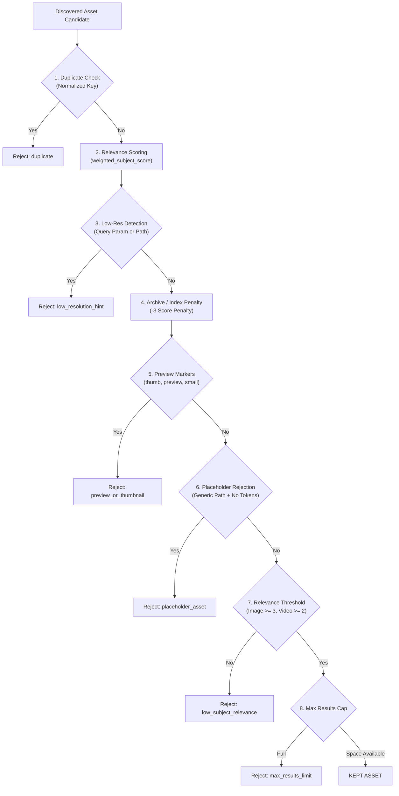

# Quality Filters Reference — scrAPE

> Detailed specification of the asset evaluation, relevance scoring, low-resolution pre-filtering, and quality rejection pipeline.

---

## 1. Filter Execution Order

Every discovered media asset candidate passes through an 8-stage evaluation pipeline in strict order:



---

## 2. Relevance Scoring Formula

Relevance scoring is calculated via `weighted_subject_score()` in `src/core/filters.py`:

$$\text{Score} = (3 \times \text{URL Matches}) + (2 \times \text{Alt Text Matches}) + (1 \times \text{Title Matches}) + \text{Entity Bonus}$$

### Token Field Weighting

| Field | Weight Multiplier | Description |
|---|---|---|
| **URL Path & Filename** | **3×** | Matches in the asset URL or filename string |
| **Alt Text & Caption** | **2×** | Matches in `alt=""`, `title=""`, or surrounding anchor text |
| **Source Page Title** | **1×** | Matches in the parent web page `<title>` tag |
| **Entity Token Bonus** | **+2 Bonus** | Awarded when an entity token is matched in high-weight fields |

### Score Acceptance Thresholds

| Media Kind | Minimum Required Score | Exception |
|---|---|---|
| **Image Asset** | `Score >= 3` | Whitelisted CDN host asset (non-archive) |
| **Video Asset** | `Score >= 2` | Whitelisted CDN host asset (non-archive) |

---

## 3. Low-Resolution Detection & Pre-Filtering

Low-resolution media items are detected and rejected using two complementary mechanisms:

### 3.1 `has_low_res_query_param(url, min_size=400)`
Scans URL query parameters for dimension hints:
- Dimension keys: `w=150`, `h=100`, `width=200`, `height=200`, `sz=small`
- Numeric values smaller than `min_size` trigger immediate rejection.

### 3.2 `has_low_res_path_pattern(url, min_width=400, min_height=300)`
Scans URL path strings for dimension regex patterns:

| Pattern Type | Example Matches | Threshold |
|---|---|---|
| **Double Dimensions** | `-150x150.jpg`, `_200x300/`, `/150x150/` | Width < 400px OR Height < 300px |
| **Resizer Paths** | `/resize/150/200`, `/w_150,h_150/`, `/fit/100/200` | Width < 400px OR Height < 300px |
| **Single Width Suffix** | `_150x.jpg` | Width < 400px |
| **Single Height Suffix** | `_x150.jpg` | Height < 300px |

### 3.3 Early Link Discovery Pre-Filtering
Inside `is_thumbnail_url()`, candidate links matching low-resolution path patterns (e.g. `/320x180/` frame screenshots) are rejected **during link discovery** before enqueueing or initiating HTTP requests. Path layouts with acceptable dimensions (e.g. `/640x360/`) are preserved for crawling.

---

## 4. Preview & Thumbnail Markers

Negative preview markers evaluated in URL strings and alt captions:

```text
'thumb', 'thumbs', 'thumbnail', '_th', '/th/', '-th-',
'preview', 'small', '150x150', '100x100', '200x200',
'tiny', 'icon', 'micro', 'mini', 'sq.', '/sq/'
```

Accumulating $\ge 4$ marker points flags the asset with rejection reason `preview_or_thumbnail`.

---

## 5. Archive & Index Page Penalties

Pages matching archive or index path patterns (`/`, `/index.html`, `/page/`, `/archive/`, `/tag/`, `/category/`, `/search/`) receive a **-3 score penalty**. 

### CDN Whitelist Bypass
Assets hosted on domain profiles annotated with `# [CDN] hostname` **bypass archive penalties entirely**, ensuring dedicated media hosts keep legitimate assets regardless of page layout.

---

## 6. `None`-Safe String Utilities

All filter evaluation routines use `safe_join(items, sep=" ")` to join token lists cleanly:

```python
def safe_join(items: list[str | None], sep: str = " ") -> str:
    return sep.join(s for s in items if s is not None)
```

This prevents runtime `TypeError` crashes when processing candidates with missing alt text, page titles, or anchor hrefs.
