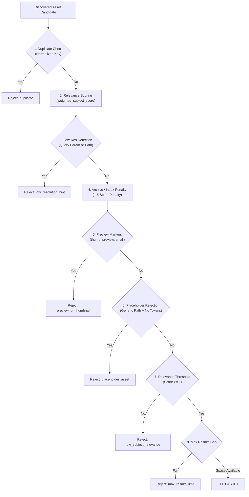

# Quality Filters Reference — scrAPE

> Detailed specification of the asset evaluation, relevance scoring, low-resolution pre-filtering, and quality rejection pipeline.

---

## 1. Filter Execution Order

Every discovered media asset candidate passes through an 8-stage evaluation pipeline in strict order:


```mermaid
flowchart TD
    A["Discovered Asset Candidate"] --> C1{"1. Duplicate Check<br/>(Normalized Key)"}
    C1 -- Yes --> R1["Reject: duplicate"]
    C1 -- No --> C2["2. Relevance Scoring<br/>(weighted_subject_score)"]

    C2 --> C3{"3. Low-Res Detection<br/>(Query Param or Path)"}
    C3 -- Yes --> R3["Reject: low_resolution_hint"]
    C3 -- No --> C4["4. Archive / Index Penalty<br/>(-15 Score Penalty)"]

    C4 --> C5{"5. Preview Markers<br/>(thumb, preview, small)"}
    C5 -- Yes --> R5["Reject: preview_or_thumbnail"]
    C5 -- No --> C6{"6. Placeholder Rejection<br/>(Generic Path + No Tokens)"}

    C6 -- Yes --> R6["Reject: placeholder_asset"]
    C6 -- No --> C7{"7. Relevance Threshold<br/>(Score >= 1)"}
    C7 -- No --> R7["Reject: low_subject_relevance"]
    C7 -- Yes --> C8{"8. Max Results Cap"}
    C8 -- Full --> R8["Reject: max_results_limit"]
    C8 -- Space Available --> Keep["KEPT ASSET"]
```

---

## 2. Relevance Scoring Formula

Relevance scoring is calculated via `weighted_subject_score()` and media-specific functions in `src/core/filters.py`.

### Base Token Score
A base token score is calculated by concatenating all available asset metadata (URL, page title, alt text, anchor text) and searching for keyword and entity tokens:
- **Exact Token Matches**: `+5` points per exact token match (bounded by word boundaries).
- **Partial/Substring Matches**: `+3` points if the token appears as a substring.

### 2.1 Image Asset Scoring Modifiers (`score_image_relevance`)

| Condition | Score Adjustment |
|---|---|
| Has Alt Text | +1 |
| Has Page Title | +1 |
| Contains generic asset term (e.g. `bg`, `logo`) | -3 |
| Contains placeholder term (e.g. `captcha`, `blank`) | -4 |
| Contains preview markers (`thumb`, `small`, etc.) | -6 (per marker) |
| Contains image term (`photo`, `gallery`, etc.) | +1 |
| Is probable image (by extension) | +2 |
| URL contains dimension queries (`w=150`, etc.) | -3 |
| In layout container | -20 |
| Width or Height < 300px | -20 |
| Domain profile expects `image` | +3 |
| Archive/Index page without subject match | -15 |

### 2.2 Video Asset Scoring Modifiers (`score_video_relevance`)

| Condition | Score Adjustment |
|---|---|
| Has Page Title | +1 |
| Known video provider (`youtube`, `vimeo`, `hls`, etc.) | +2 |
| Contains video term (`video`, `clip`, `watch`, etc.) | +1 |
| Is probable video (by extension) | +2 |
| In layout container | -20 |
| Domain profile expects `video` | +3 |
| Archive/Index page without subject match | -15 |

### Score Acceptance Thresholds

| Media Kind | Minimum Required Score | Exception |
|---|---|---|
| **All Assets** | `Score >= 1` | Whitelisted CDN host asset (bypasses archive penalty) |

---

## 3. Low-Resolution Detection & Pre-Filtering

Low-resolution media items are detected and rejected using two complementary mechanisms:

### 3.1 `has_low_res_query_param(url, min_size=400)`
Scans URL query parameters for dimension hints:
- Dimension keys: `w=150`, `h=100`, `width=200`, `height=200`, `sz=small`
- Numeric values smaller than `min_size` trigger immediate rejection.

### 3.2 `has_low_res_path_pattern(url, min_width=400, min_height=300)`
Scans URL path strings for dimension regex patterns:

| Pattern Type | Example Matches | Threshold |
|---|---|---|
| **Double Dimensions** | `-150x150.jpg`, `_200x300/`, `/150x150/` | Width < 400px OR Height < 300px |
| **Resizer Paths** | `/resize/150/200`, `/w_150,h_150/`, `/fit/100/200` | Width < 400px OR Height < 300px |
| **Single Width Suffix** | `_150x.jpg` | Width < 400px |
| **Single Height Suffix** | `_x150.jpg` | Height < 300px |

### 3.3 Search Query Page Pre-Filtering (`is_search_page_url`)
`is_search_page_url(url)` checks whether a URL points to an un-crawlable search query endpoint (`/search?q=`, `?text=`, `search_query=`, `/results?`) on Google, Vimeo, Flickr, or YouTube. Matching query URLs are skipped during link discovery before requesting or enqueueing.

### 3.4 Early Link Discovery & High-Res Upscaling (`transform_to_highres`)
Inside `is_thumbnail_url()`, candidate links matching low-resolution path patterns (e.g. `/320x180/` frame screenshots) are rejected **during link discovery**.

When valid thumbnails are enqueued, `transform_to_highres(url)` predicts the original high-resolution asset URL using heuristic path rules:
- **Erome**: Replaces thumbnail directories `/t/` or `/th/` with high-res `/v/`.
- **WordPress**: Strips `-scaled.jpg` / `-scaled.png` and dimension patterns (`-1024x768.png`).
- **Twitter**: Replaces `name=small` or `name=medium` with `name=large`.
- **Generic Thumbnails**: Replaces `/thumbs/` $\rightarrow$ `/images/` and `/video_thumbs/` $\rightarrow$ `/video_sources/`.

---

## 4. Preview & Thumbnail Markers

Negative preview markers evaluated in URL strings and alt captions:

```text
'thumb', 'thumbs', 'thumbnail', '_th', '/th/', '-th-',
'preview', 'small', '150x150', '100x100', '200x200',
'tiny', 'icon', 'micro', 'mini', 'sq.', '/sq/'
```

Accumulating $\ge 4$ marker points flags the asset with rejection reason `preview_or_thumbnail`.

---

## 5. Archive & Index Page Penalties

Pages matching archive or index path patterns (`/`, `/index.html`, `/page/`, `/archive/`, `/tag/`, `/category/`, `/search/`) receive a **-15 score penalty** unless they explicitly contain a subject keyword match. 

### CDN Whitelist Bypass
Assets hosted on domain profiles annotated with `# [CDN] hostname` **bypass archive penalties entirely**, ensuring dedicated media hosts keep legitimate assets regardless of page layout.

---

## 6. `None`-Safe String Utilities

All filter evaluation routines use `safe_join(items, sep=" ")` to join token lists cleanly:

```python
def safe_join(items: list[str | None], sep: str = " ") -> str:
    return sep.join(s for s in items if s is not None)
```

This prevents runtime `TypeError` crashes when processing candidates with missing alt text, page titles, or anchor hrefs.
